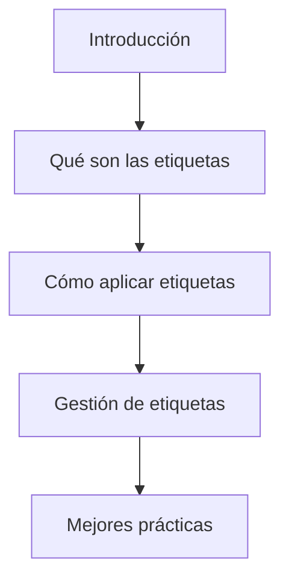
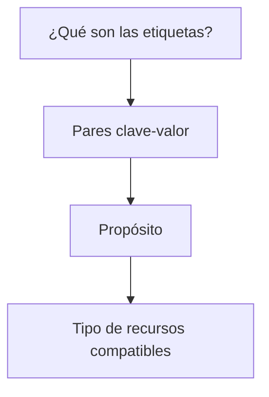
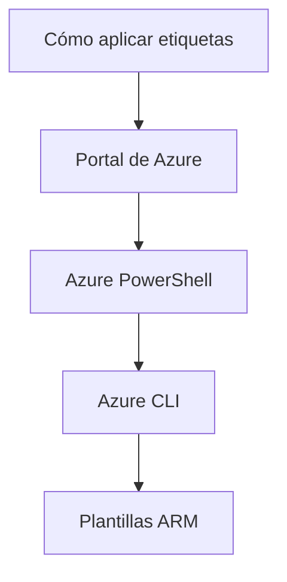
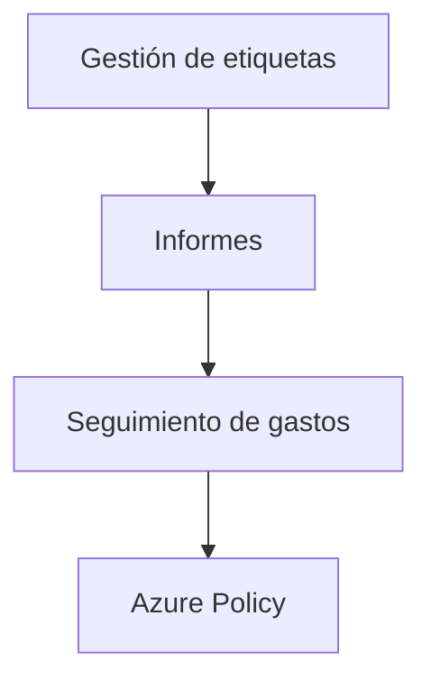
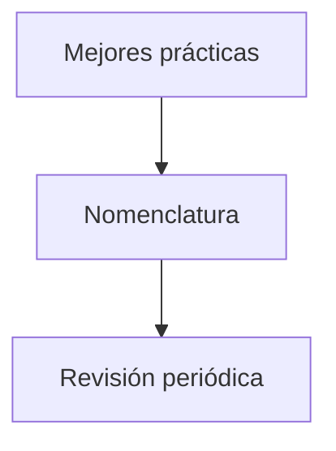

### Aplicar y gestionar etiquetas en recursos en Azure

#### Introducción

Las etiquetas son metadatos clave-valor que se pueden aplicar a los recursos en Azure para categorizar y organizarlos de una manera más eficiente. Las etiquetas son fundamentales para gestionar Azure Subscriptions y Governance. Este contenido abordará cómo aplicar y gestionar etiquetas en recursos de Azure.



#### ¿Qué son las etiquetas?

Las etiquetas son pares de clave-valor asignados a recursos para mejorar la administración de los mismos. Estas permiten agrupar recursos que pertenecen a una misma categoría, facilitando así tareas como el monitoreo, la facturación y la automatización.



| Término               | Descripción                                                   |
|----------------------|---------------------------------------------------------------|
| Pares clave-valor     | El formato básico de una etiqueta.                            |
| Propósito             | La necesidad de usar etiquetas para organización y monitoreo. |
| Tipo de recursos      | Los recursos de Azure que admiten etiquetas.                  |

#### Cómo aplicar etiquetas

Las etiquetas pueden aplicarse manualmente desde el portal de Azure, mediante Azure PowerShell, Azure CLI o a través de plantillas ARM (Azure Resource Manager).

##### Portal de Azure
Para aplicar etiquetas desde el portal de Azure, solo necesita acceder al recurso deseado y añadir las etiquetas en la sección correspondiente.

```powershell
# Ejemplo de cómo añadir una etiqueta mediante PowerShell
Set-AzResource -ResourceId [ResourceID] -Tag @{Name="value"}
```



| Término           | Descripción                                           |
|------------------|-------------------------------------------------------|
| Portal de Azure   | Interfaz gráfica para gestionar recursos.             |
| Azure PowerShell | Línea de comandos específica para Azure en PowerShell.|
| Azure CLI        | Interfaz de línea de comandos para Azure.             |
| Plantillas ARM    | Plantillas para desplegar recursos en Azure.          |

#### Gestión de etiquetas

Una vez aplicadas, las etiquetas pueden ser utilizadas para generar informes, realizar seguimiento de gastos o automatizar tareas.

##### Azure Policy
Puedes usar Azure Policy para exigir que ciertas etiquetas estén presentes en todos los recursos.

```json
{
  "if": {
    "allOf": [
      {
        "field": "tags",
        "exists": "false"
      }
    ]
  },
  "then": {
    "effect": "deny"
  }
}
```



| Término            | Descripción                              |
|--------------------|------------------------------------------|
| Informes           | Generar informes basados en etiquetas.   |
| Seguimiento de gastos | Monitoreo de costos con etiquetas.    |
| Azure Policy       | Políticas para gestionar etiquetas.      |

#### Mejores prácticas

Para sacar el máximo provecho de las etiquetas, sigue algunas de las mejores prácticas como mantener una nomenclatura coherente y revisar las etiquetas periódicamente.



| Término            | Descripción                              |
|--------------------|------------------------------------------|
| Nomenclatura       | Mantener nombres coherentes para las etiquetas.|
| Revisión periódica | Actualización y revisión regular de las etiquetas.|

### Cuadro Sinóptico

- **Aplicar y gestionar etiquetas**
  - **Introducción**
    - Propósito y visión general.
  - **¿Qué son las etiquetas?**
    - Definición y utilidades.
  - **Cómo aplicar etiquetas**
    - Varios métodos: Portal de Azure, Azure PowerShell, Azure CLI, Plantillas ARM.
  - **Gestión de etiquetas**
    - Informes, seguimiento de gastos, Azure Policy.
  - **Mejores prácticas**
    - Nomenclatura y revisión periódica.

Espero que esta información sea de gran ayuda para entender cómo aplicar y gestionar etiquetas en recursos de Azure. Ahora podrás abordar este aspecto con un enfoque más estructurado y eficiente.
