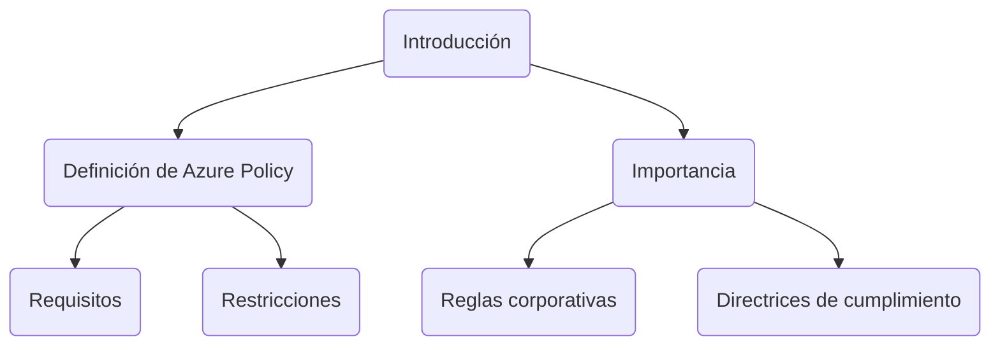
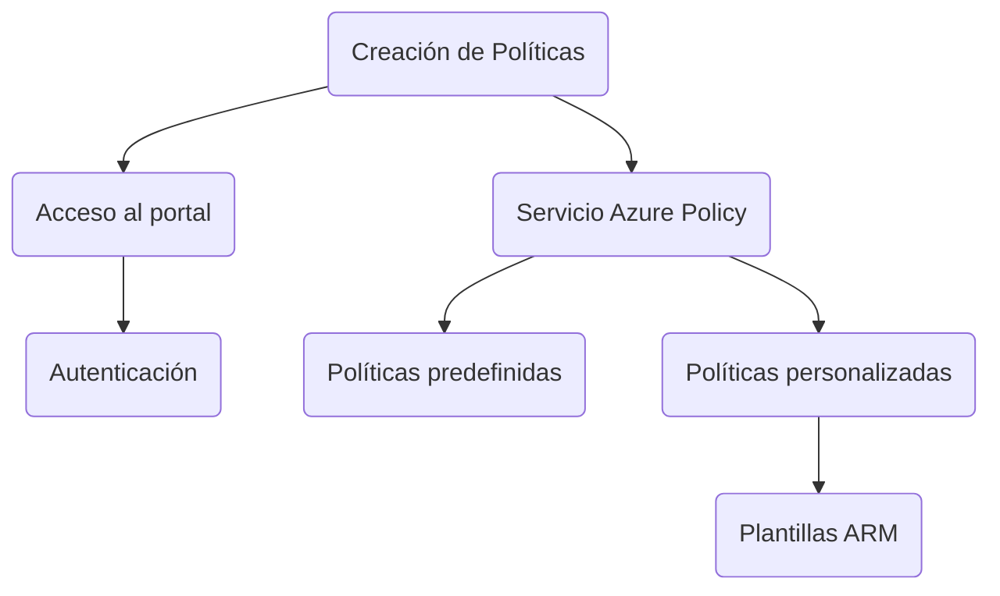
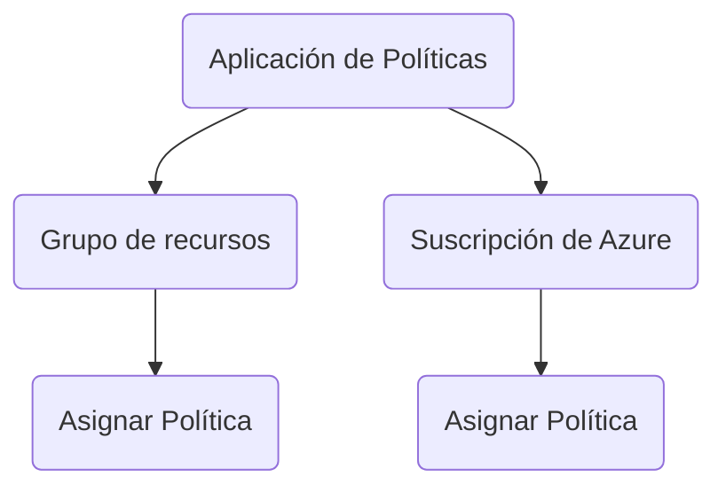
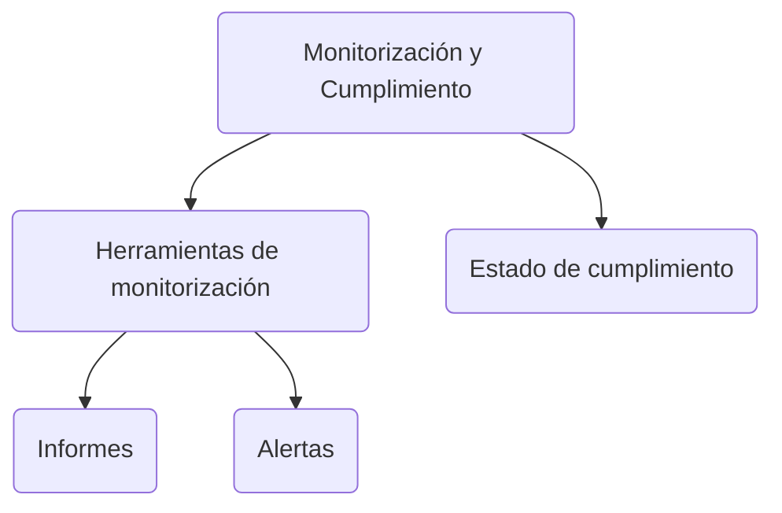

# Configure and Manage Azure Policy

## Introducción

Azure Policy es una característica de Azure que permite a los administradores definir requisitos y restricciones específicas para los recursos en un ambiente de Azure. Mediante la creación y aplicación de políticas, se garantiza que los recursos se mantengan en conformidad con las reglas corporativas y las directrices de cumplimiento.



**Glosario**

| Término                  | Descripción                                                  |
|-------------------------|--------------------------------------------------------------|
| Azure Policy             | Herramienta para crear y aplicar políticas en Azure.         |
| Reglas corporativas     | Normas establecidas por una organización.                     |
| Directrices de cumplimiento | Regulaciones que deben seguirse en un entorno empresarial. |

## Creación de Políticas

Para crear una política en Azure, primero debes acceder al portal de Azure y navegar hasta el servicio "Azure Policy". Aquí, puedes optar por utilizar políticas predefinidas o crear políticas personalizadas mediante el uso de plantillas de Azure Resource Manager (ARM).



**Glosario**

| Término                  | Descripción                                                   |
|-------------------------|---------------------------------------------------------------|
| Azure Resource Manager  | Servicio que facilita la administración de recursos en Azure. |
| Plantillas ARM          | Plantillas para definir recursos y configuraciones en Azure.  |

### Ejemplo de Código

```json
{
  "policyRule": {
    "if": {
      "field": "type",
      "equals": "Microsoft.Storage/storageAccounts"
    },
    "then": {
      "effect": "deny"
    }
  }
}
```

## Aplicación de Políticas

Una vez creada una política, el siguiente paso es aplicarla a un grupo de recursos o a una suscripción de Azure. De esta manera, se puede asegurar que los recursos estén en conformidad con las directrices especificadas.



**Glosario**

| Término             | Descripción                                      |
|--------------------|--------------------------------------------------|
| Grupo de recursos  | Conjunto de recursos relacionados en Azure.      |
| Suscripción de Azure| Acuerdo de licencia y facturación con Azure.     |

## Monitorización y Cumplimiento

Una vez aplicadas las políticas, Azure Policy proporciona herramientas para monitorizar el estado de cumplimiento de los recursos. Se pueden generar informes y alertas para mantenerse actualizado sobre cualquier desviación.



**Glosario**

| Término               | Descripción                                         |
|----------------------|-----------------------------------------------------|
| Estado de cumplimiento| Nivel de adherencia a las políticas establecidas.   |
| Informes              | Documentos que detallan el estado de los recursos.  |
| Alertas               | Notificaciones sobre desviaciones de la política.  |

## Cuadro Sinóptico

| Sección                      | Acciones Clave                                        | Herramientas y Términos Asociados   |
|------------------------------|--------------------------------------------------------|-------------------------------------|
| Introducción                 | Comprender qué es Azure Policy y su importancia.       | Azure Policy, Reglas Corporativas   |
| Creación de Políticas        | Acceder a Azure, usar el servicio Azure Policy.        | Azure Resource Manager, Plantillas ARM |
| Aplicación de Políticas      | Asignar políticas a grupos de recursos o suscripciones.| Grupo de recursos, Suscripción de Azure |
| Monitorización y Cumplimiento| Utilizar herramientas para verificar el cumplimiento.  | Estado de cumplimiento, Informes    |

Espero que esta información te ayude en tu preparación para el examen AZ-104.
