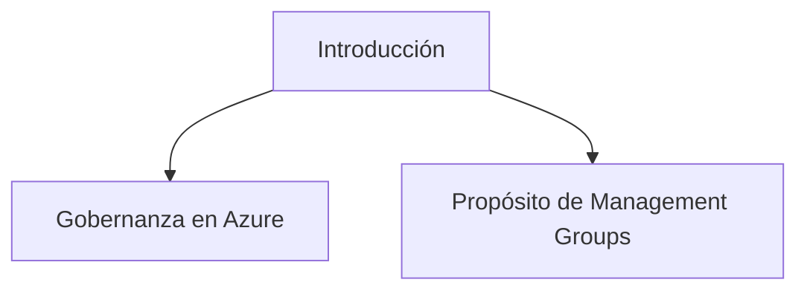
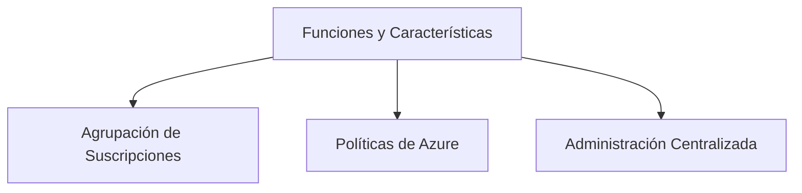
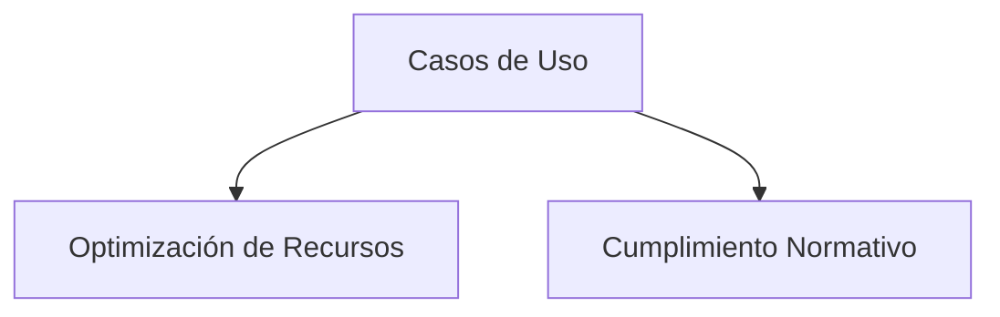
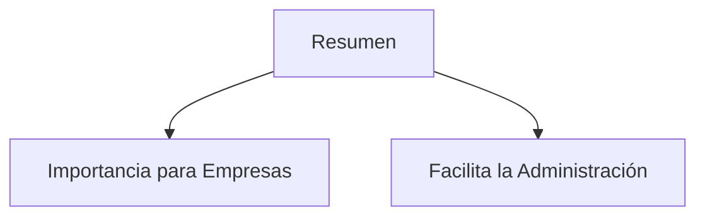

# Configure Management Groups

## Introducción

El manejo efectivo de recursos y acceso en Azure requiere una estrategia bien definida de gobernanza y administración. En este contexto, los *Management Groups* proporcionan un mecanismo para agrupar múltiples suscripciones de Azure. Esta agrupación ayuda en la aplicación coherente de políticas y mucho más.



**Glosario**

| Término                   | Definición                                                   |
|---------------------------|--------------------------------------------------------------|
| Gobernanza                | Es el conjunto de políticas y procesos que controlan cómo se administran y utilizan los recursos en una organización.   |
| Management Groups         | Agrupaciones de suscripciones de Azure para la administración coherente de políticas, acceso y cumplimiento.          |

## Funciones y Características

Los *Management Groups* son especialmente útiles para empresas que tienen un gran número de suscripciones de Azure y necesitan una administración centralizada. Vamos a explorar las características y funciones que ofrecen.



**Glosario**

| Término                     | Definición                                                   |
|-----------------------------|--------------------------------------------------------------|
| Agrupación de Suscripciones  | Proceso de combinar múltiples suscripciones bajo una única entidad para una administración más fácil.|
| Políticas de Azure           | Reglas que se aplican a los recursos de Azure para asegurar el cumplimiento y la administración. |
| Administración Centralizada  | Supervisión y gestión de recursos y políticas desde un único punto. |

### Agrupación de Suscripciones

```azurecli
# Crear un Management Group
az account management-group create --name "MyManagementGroup"
```

### Políticas de Azure

```azurecli
# Asignar una política a un Management Group
az policy assignment create --name "policyAssignment" --scope "/providers/Microsoft.Management/managementGroups/MyManagementGroup" --policy "policyDefinition"
```

### Administración Centralizada

## Casos de Uso

Los *Management Groups* son extremadamente versátiles y pueden ser usados en una variedad de escenarios, desde la optimización del uso de recursos hasta el cumplimiento normativo.



**Glosario**

| Término                     | Definición                                                   |
|-----------------------------|--------------------------------------------------------------|
| Optimización de Recursos     | La práctica de ajustar y administrar recursos para mejorar la eficiencia operativa. |
| Cumplimiento Normativo       | Adherencia a leyes, regulaciones y políticas internas.       |

## Resumen

La utilización de *Management Groups* es esencial para la administración eficaz de recursos en Azure, especialmente para organizaciones con múltiples suscripciones. Ayudan a implementar políticas de forma coherente y facilitan la administración centralizada.



## Cuadro Sinóptico

| Sección                    | Detalles                                                     |
|----------------------------|--------------------------------------------------------------|
| Introducción               | Presenta los conceptos básicos de Management Groups y su importancia en la gobernanza de Azure.  |
| Funciones y Características| Detalla las funciones y características principales, incluidas la agrupación de suscripciones y la administración de políticas.|
| Casos de Uso               | Describe diferentes escenarios en los que los Management Groups son útiles.|
| Resumen                    | Recapitula la importancia de utilizar Management Groups para una gestión eficaz.|
