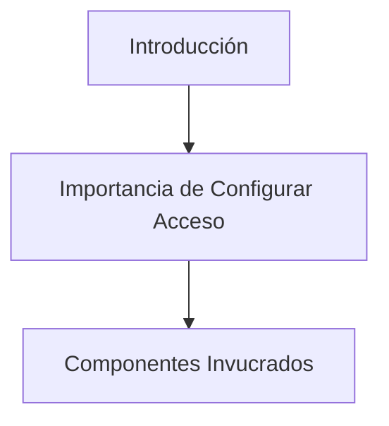
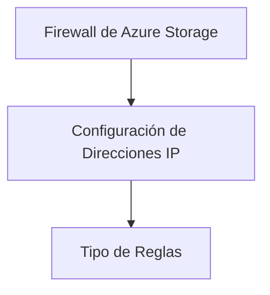
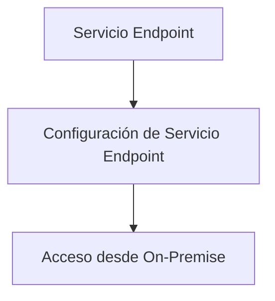
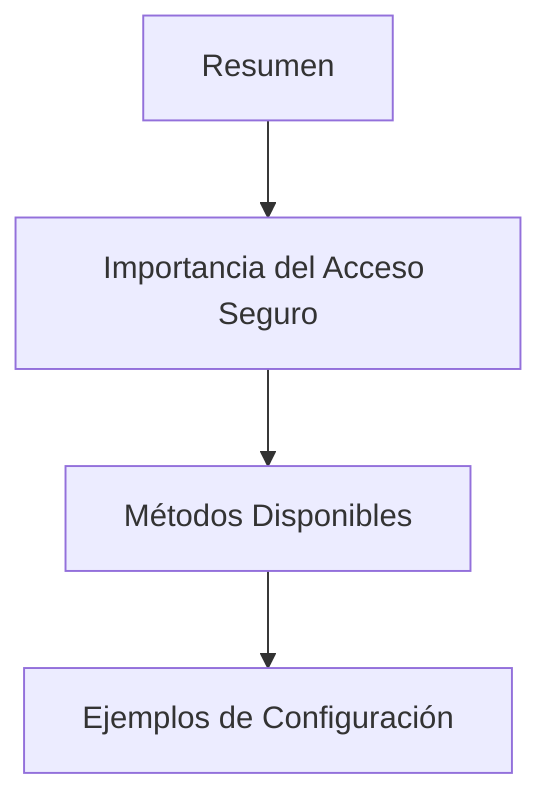

# Configurar el Acceso de Red a las Storage Accounts

## Introducción

Cuando se trabaja con cuentas de almacenamiento en Azure, es crucial garantizar que solo las entidades autorizadas tengan acceso a estos recursos. En esta discusión, exploraremos cómo configurar el acceso de red a las cuentas de almacenamiento de Azure (Storage Accounts).



| Término | Definición |
| ------- | ---------- |
| Storage Accounts | Servicio de Azure utilizado para almacenar datos. |
| Acceso de Red | Reglas y políticas que controlan quién puede acceder a un recurso en una red. |

## Firewall de Azure Storage

Azure ofrece un firewall para las cuentas de almacenamiento que permite a los usuarios especificar una gama de direcciones IP permitidas. Solo las solicitudes de esas direcciones IP podrán acceder a la cuenta de almacenamiento.



| Término | Definición |
| ------- | ---------- |
| Firewall | Sistema de seguridad que filtra el tráfico de red. |
| Direcciones IP | Identificador único de un dispositivo en una red. |

### Ejemplo de Configuración de Firewall

```azurecli
az storage account update --name MyStorageAccount --resource-group MyResourceGroup --default-action Deny --ip-rule <dirección_ip>
```

## Redes Virtuales (VNET)

Además del firewall, se puede configurar el acceso a través de Redes Virtuales (VNET). Este método garantiza que solo las máquinas dentro de una VNET específica puedan acceder a la cuenta de almacenamiento.

```mermaid
graph TD;
    A[Redes Virtuales (VNET)] --> B[Configuración de VNET]
    B --> C[Asociación con Storage Account]
```

| Término | Definición |
| ------- | ---------- |
| VNET | Virtual Network en Azure que permite a varios recursos conectarse entre sí de forma segura. |
| Asociación | Conexión entre dos o más entidades para compartir recursos. |

### Ejemplo de Configuración de VNET

```azurecli
az storage account network-rule add --account-name MyStorageAccount --vnet-name MyVnet --subnet MySubnet
```

## Servicio Endpoint

Si necesitas acceder a tu Storage Account desde una red on-premise, puedes usar un Servicio Endpoint para hacerlo de manera segura.



| Término | Definición |
| ------- | ---------- |
| Servicio Endpoint | Punto de conexión en una red para acceder a servicios específicos. |
| On-Premise | Infraestructura de IT que se encuentra físicamente dentro del edificio de una organización. |

## Resumen

Asegurar el acceso a las Storage Accounts es un aspecto crítico para cualquier implementación en Azure. Se puede hacer esto a través del firewall de Azure, configurando el acceso desde redes virtuales o usando Servicio Endpoint para el acceso desde redes on-premise.



| Término | Definición |
| ------- | ---------- |
| Resumen | Recapitulación de los puntos clave discutidos. |
| Métodos Disponibles | Opciones que se pueden utilizar para un fin específico. |

## Cuadro Sinóptico

| Tema | Método | Ejemplo de Configuración |
| ---- | ------ | ------------------------ |
| Firewall de Azure Storage | Direcciones IP Permitidas | `az storage account update --name MyStorageAccount --default-action Deny --ip-rule <dirección_ip>` |
| Redes Virtuales (VNET) | Configuración dentro de VNET | `az storage account network-rule add --account-name MyStorageAccount --vnet-name MyVnet --subnet MySubnet` |
| Servicio Endpoint | Configuración de endpoint | No aplicable |

Las posibles alternativas para configurar el acceso a las Storage Accounts son:

1. Utilizar el firewall de Azure Storage y especificar direcciones IP.
2. Configurar Redes Virtuales (VNET) para limitar el acceso solo a recursos dentro de esa VNET.
3. Utilizar un Servicio Endpoint para el acceso desde redes on-premise.
