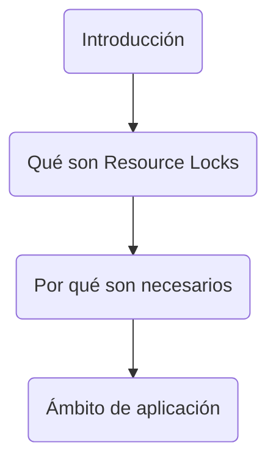
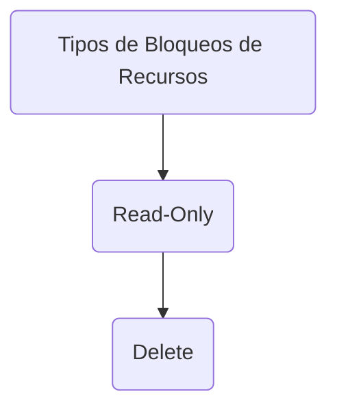
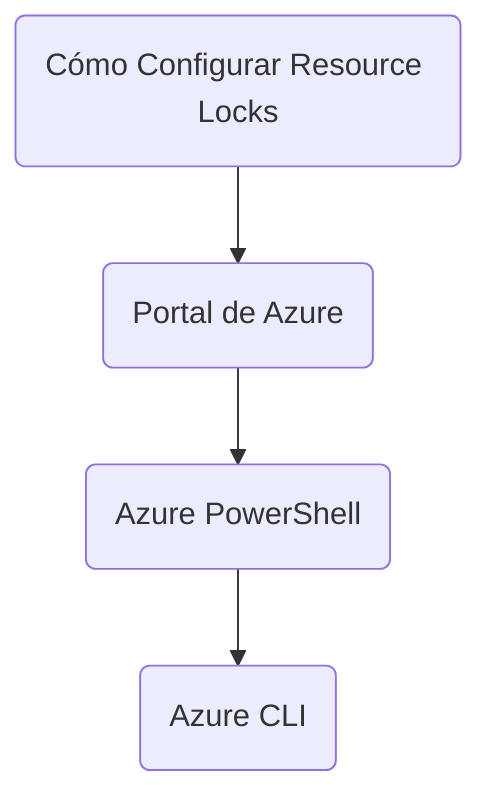
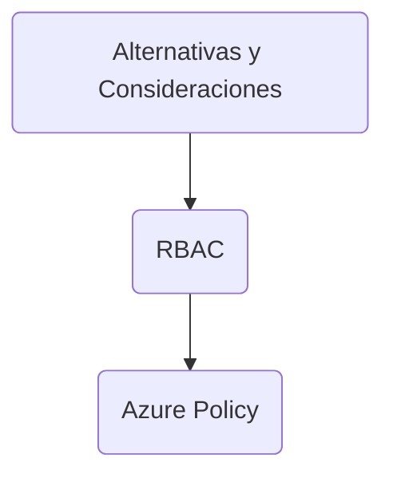
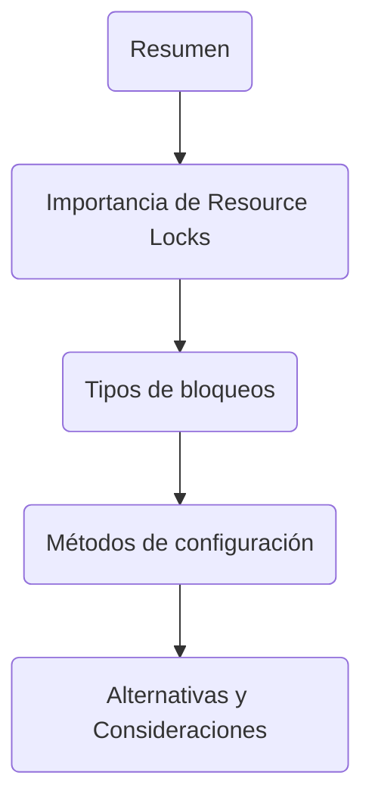

## Configure Resource Locks en Azure

### Introducción

Azure ofrece una capa adicional de control y seguridad sobre sus recursos mediante algo conocido como "Resource Locks" (Bloqueos de Recursos). Estos bloqueos previenen la eliminación o modificación accidentales de recursos críticos. En este contexto, exploraremos cómo configurar y gestionar los Resource Locks en Azure.



- **Qué son Resource Locks**: Mecanismo de seguridad para prevenir modificaciones o eliminaciones accidentales.
- **Por qué son necesarios**: Para proteger recursos críticos.
- **Ámbito de aplicación**: Recursos individuales, grupos de recursos o suscripciones enteras.

### Tipos de Bloqueos de Recursos

Azure ofrece principalmente dos tipos de bloqueos de recursos: `Read-Only` y `Delete`.



| Término    | Descripción                                                                                           |
|------------|-------------------------------------------------------------------------------------------------------|
| Read-Only  | Este bloqueo previene que el recurso sea modificado pero permite la lectura del mismo.                 |
| Delete     | Este bloqueo previene que el recurso sea eliminado pero permite que se realicen modificaciones.        |

#### Read-Only

Impide cualquier tipo de modificación en el recurso, aunque sí permite operaciones de lectura.

```azurecli
az lock create --name MyReadOnlyLock --lock-type ReadOnly --resource-group MyResourceGroup
```

#### Delete

Permite modificaciones en el recurso pero impide su eliminación.

```azurecli
az lock create --name MyDeleteLock --lock-type CanNotDelete --resource-group MyResourceGroup
```

### Cómo Configurar Resource Locks

La configuración de Resource Locks puede realizarse desde el portal de Azure, Azure PowerShell o Azure CLI.



- **Portal de Azure**: Navegue hasta el recurso y seleccione el bloqueo desde la sección "Configuración".
- **Azure PowerShell**: Utilice el cmdlet `New-AzResourceLock`.
- **Azure CLI**: Utilice el comando `az lock create`.

### Alternativas y Consideraciones

1. **Role-Based Access Control (RBAC)**: Otra forma de gestionar el acceso y las operaciones permitidas en los recursos de Azure.
2. **Azure Policy**: Permite la aplicación de reglas y efectos a nivel de suscripción o grupo de recursos.



### Resumen

Los Resource Locks son una capa adicional de seguridad en Azure que ayudan a prevenir modificaciones o eliminaciones no deseadas. Hay dos tipos principales: `Read-Only` y `Delete`. Estos bloqueos pueden configurarse a través del portal de Azure, Azure PowerShell o Azure CLI.



| Término    | Descripción                                                                                            |
|------------|--------------------------------------------------------------------------------------------------------|
| RBAC       | Control de acceso basado en roles.                                                                       |
| Azure Policy | Define reglas y efectos en los recursos.                                                                 |
| Portal de Azure | Interfaz web para gestionar recursos de Azure.                                                           |
| Azure PowerShell | Herramienta de línea de comandos para gestionar recursos de Azure.                                       |
| Azure CLI | Otra herramienta de línea de comandos para la gestión de Azure.                                           |

Espero que esta información sea de gran ayuda para entender cómo funcionan los Resource Locks en Azure y cómo se pueden configurar y gestionar de forma efectiva.
