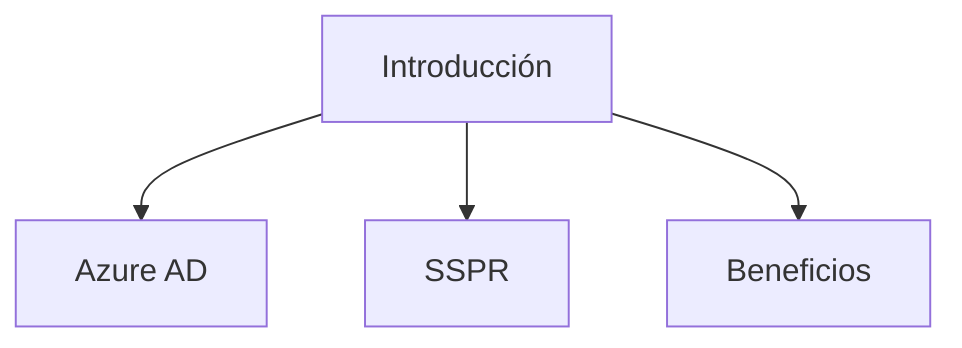
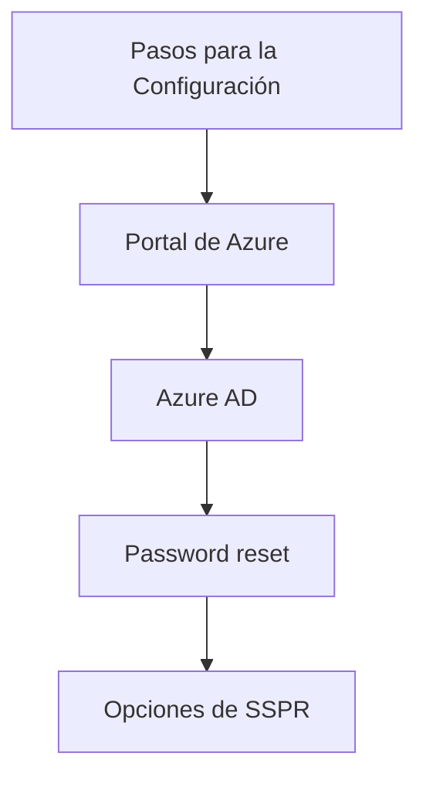
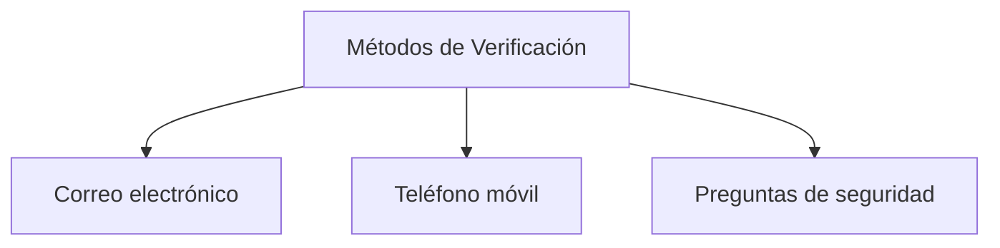
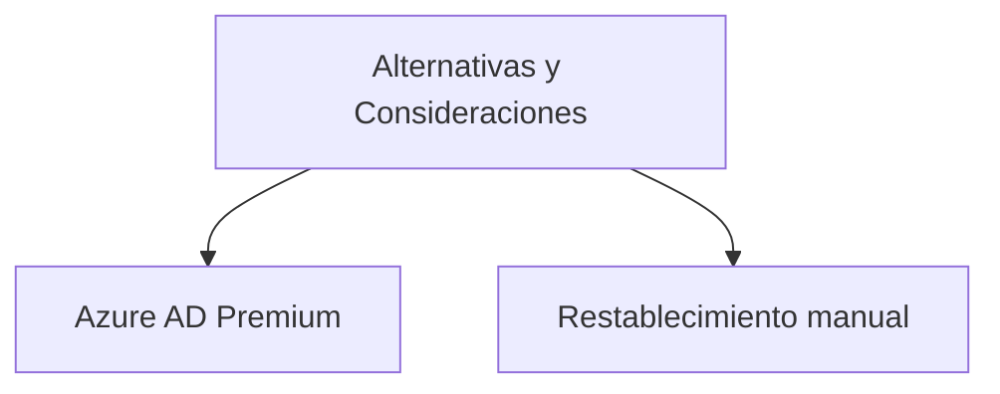

### Configure Self-Service Password Reset

---

#### Introducción
En entornos empresariales, uno de los problemas más comunes es el olvido de contraseñas por parte de los usuarios. Para resolver esto, Azure AD ofrece una solución eficaz: Self-Service Password Reset (SSPR). Esta funcionalidad permite a los usuarios restablecer sus propias contraseñas sin intervención administrativa, ahorrando tiempo y recursos.

| Término | Descripción |
|--------|------------|
| Azure AD | El servicio de directorio en la nube de Microsoft Azure. |
| SSPR | Self-Service Password Reset, una funcionalidad para el restablecimiento de contraseñas.|
| Beneficios | Ventajas de usar SSPR, como ahorro de tiempo y recursos.|

---

#### Pasos para la Configuración
Para habilitar SSPR en Azure AD, sigue los siguientes pasos:

1. Ve al portal de Azure y navega hasta Azure Active Directory.
2. Selecciona "Password reset" en el menú de la izquierda.
3. Habilita SSPR y configura las opciones según las necesidades de tu organización.

| Término | Descripción |
|--------|------------|
| Portal de Azure | Portal web para gestionar servicios de Azure. |
| Azure AD | Servicio de directorio en la nube. |
| Password reset | Opción en el menú de Azure AD para la configuración de SSPR. |
| Opciones de SSPR | Configuraciones como métodos de verificación y políticas. |

---

#### Métodos de Verificación
Los métodos de verificación disponibles son:

- Correo electrónico
- Teléfono móvil
- Preguntas de seguridad

| Término | Descripción |
|--------|------------|
| Correo electrónico | Método que utiliza el correo electrónico para la verificación. |
| Teléfono móvil | Utiliza un número de teléfono móvil para enviar un código. |
| Preguntas de seguridad | Preguntas predefinidas para verificar la identidad. |

---

#### Alternativas y Consideraciones
Si bien SSPR es muy útil, hay otras alternativas y consideraciones a tener en cuenta:

- Azure AD Premium ofrece más opciones de personalización.
- Para usuarios sin acceso a métodos de verificación, los administradores aún deben restablecer la contraseña manualmente.

| Término | Descripción |
|--------|------------|
| Azure AD Premium | Versión mejorada de Azure AD con más funcionalidades. |
| Restablecimiento manual | Proceso administrativo para usuarios sin métodos de verificación. |

---

#### Cuadro Sinóptico

| Aspecto | Descripción | Alternativas |
|---------|-------------|--------------|
| Implementación | Fácil de habilitar desde Azure AD | Azure AD Premium para más opciones |
| Verificación | Múltiples métodos disponibles | Ninguna |
| Administración | Reducción de la carga administrativa | Restablecimiento manual si es necesario |

Al configurar Self-Service Password Reset, no solo haces más eficiente la administración de contraseñas, sino que también mejoras la experiencia del usuario y la seguridad organizacional.
