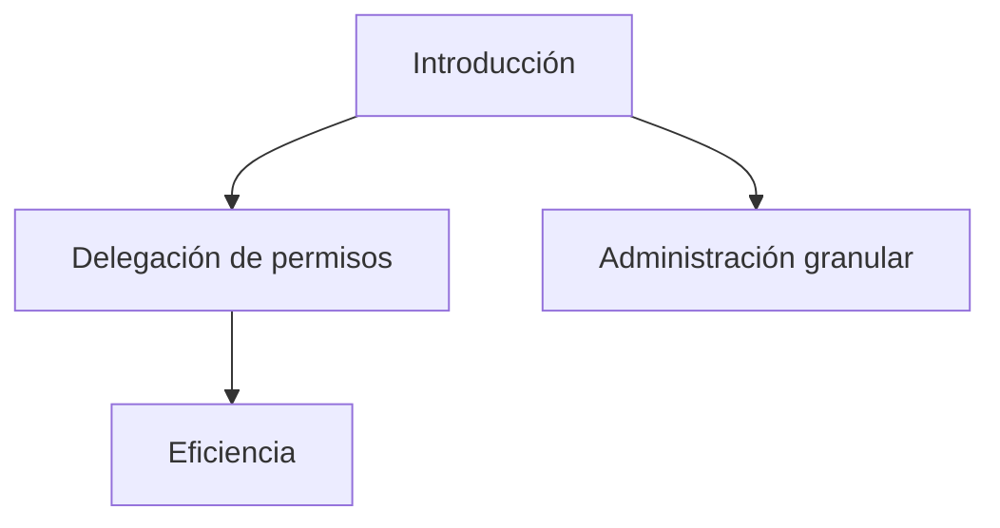
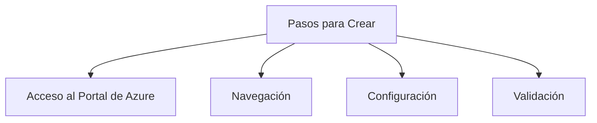
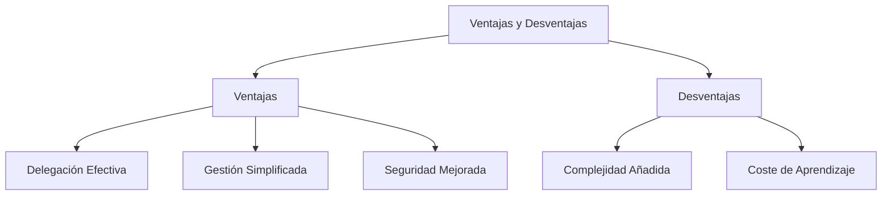

## Creación de Unidades Administrativas en Azure AD

### Introducción

Las unidades administrativas en Azure Active Directory (Azure AD) ofrecen una manera eficaz de delegar permisos y administrar recursos de forma más granular. En un entorno con numerosos usuarios y recursos, puede ser desafiante mantener una gestión eficiente. Aquí es donde entran en juego las unidades administrativas.



**Glosario**  

| Término            | Definición                                    |
|--------------------|------------------------------------------------|
| Delegación de permisos  | Distribución de autoridades a diferentes roles o unidades dentro de una organización |
| Administración granular | Gestión detallada a nivel de recurso o usuario |
| Eficiencia            | Capacidad de realizar tareas con mínimo desperdicio de recursos |

---

### Pasos para Crear una Unidad Administrativa

1. **Acceso al Portal de Azure**: Primero, debe ingresar al portal de Azure utilizando credenciales que tengan permisos para crear unidades administrativas.
   
2. **Navegación**: Diríjase a "Azure Active Directory" > "Unidades Administrativas" > "Agregar".
   
3. **Configuración**: A continuación, configure la unidad con un nombre único y asignele un grupo o usuario que la administrará.

4. **Validación**: Finalmente, valide que la unidad administrativa haya sido creada correctamente revisando en la lista de "Unidades Administrativas".



**Glosario**  

| Término          | Definición                                    |
|------------------|------------------------------------------------|
| Acceso al Portal de Azure | Ingresar al interfaz web de Azure  |
| Navegación       | Proceso de moverse a través de las opciones del portal de Azure |
| Configuración    | Ajustes que definen una unidad administrativa  |
| Validación       | Confirmación de que el proceso se ha completado correctamente  |

```azurecli
# Ejemplo de código para crear una unidad administrativa utilizando Azure CLI
az ad admin-unit create --description "Descripción" --display-name "NombreDeUnidad"
```

---

### Ventajas y Desventajas

#### Ventajas:

- **Delegación Efectiva**: Permite asignar roles de administrador a nivel de unidad.
  
- **Gestión Simplificada**: Facilita la organización de recursos y usuarios.
  
- **Seguridad Mejorada**: Las unidades administrativas reducen el riesgo al limitar el alcance de los roles de administrador.

#### Desventajas:

- **Complejidad Añadida**: Puede complicar la gestión si no se configura adecuadamente.
  
- **Coste de Aprendizaje**: Requiere una curva de aprendizaje para implementar y administrar eficazmente.



**Glosario**  

| Término             | Definición                                      |
|---------------------|--------------------------------------------------|
| Delegación Efectiva  | Asignación de roles de forma estratégica         |
| Gestión Simplificada | Facilitar la administración de recursos y usuarios|
| Seguridad Mejorada   | Mejora en los controles de acceso                |
| Complejidad Añadida  | Aumento en la dificultad de la gestión           |
| Coste de Aprendizaje | Tiempo y recursos necesarios para comprender una nueva funcionalidad |

---

## Cuadro Sinóptico

| Sección                         | Puntos Clave                                        |
|---------------------------------|-----------------------------------------------------|
| Introducción                    | Delegación de permisos, Administración granular, Eficiencia |
| Pasos para Crear una Unidad Administrativa | Acceso al Portal de Azure, Navegación, Configuración, Validación |
| Ventajas y Desventajas          | Delegación Efectiva, Gestión Simplificada, Seguridad Mejorada, Complejidad Añadida, Coste de Aprendizaje |
