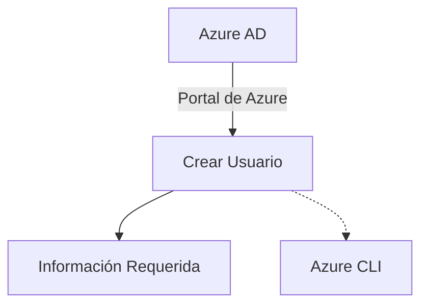
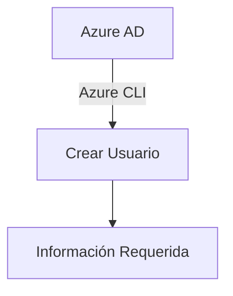
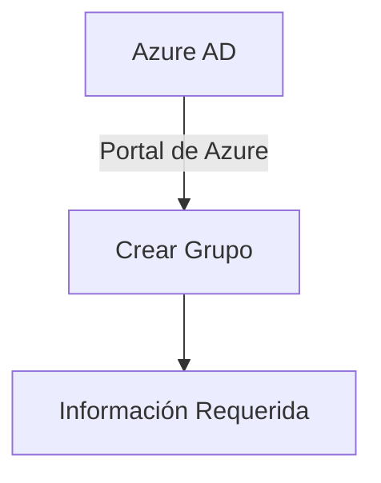
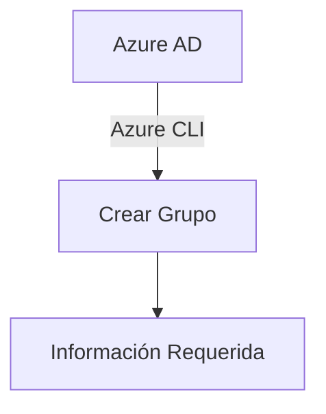
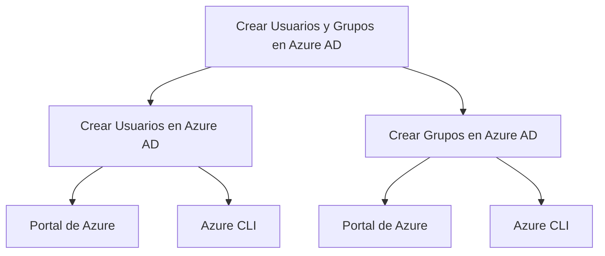
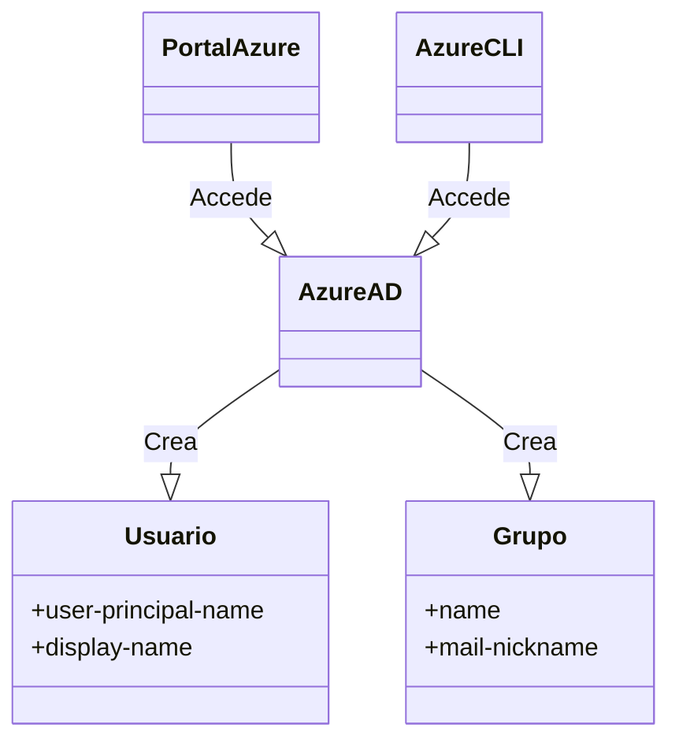

# Crear Usuarios y Grupos en Azure AD

Azure Active Directory (Azure AD) es el servicio de directorio y gestión de identidad que ofrece Microsoft Azure. La gestión de objetos en Azure AD, como usuarios y grupos, es una tarea esencial para el administrador de Azure. Aquí te explicaré detalladamente cómo crear usuarios y grupos en Azure AD.

## Crear Usuarios en Azure AD

### Portal de Azure
1. Ve al portal de Azure y navega hasta Azure AD.
2. Selecciona la opción "Usuarios" y luego "Nuevo Usuario".
3. Completa la información requerida y presiona "Crear".

```azurecli
az ad user create --user-principal-name usuario@dominio.com --display-name "Usuario Ejemplo"
```



### Azure CLI
Otra forma de crear un usuario es utilizando la Azure Command-Line Interface (CLI).

```azurecli
az ad user create --user-principal-name usuario@dominio.com --display-name "Usuario Ejemplo"
```



#### Alternativas
- Utilizar PowerShell para automatizar la creación de usuarios.
- Importar usuarios desde un archivo CSV.

## Crear Grupos en Azure AD

### Portal de Azure
1. Ve al portal de Azure y navega hasta Azure AD.
2. Selecciona la opción "Grupos" y luego "Nuevo Grupo".
3. Completa la información requerida y presiona "Crear".



### Azure CLI
Al igual que con los usuarios, también puedes utilizar la Azure CLI para crear grupos.

```azurecli
az ad group create --name "NombreDelGrupo" --mail-nickname "Alias"
```



#### Alternativas
- Utilizar PowerShell para automatizar la creación de grupos.
- Importar grupos desde un archivo CSV.



## Glosario


## Cuadro Sinóptico

| Tema            | Portal de Azure | Azure CLI      | Alternativas      |
|-----------------|-----------------|----------------|-------------------|
| Crear Usuarios  | ✔️              | ✔️             | PowerShell, CSV   |
| Crear Grupos    | ✔️              | ✔️             | PowerShell, CSV   |