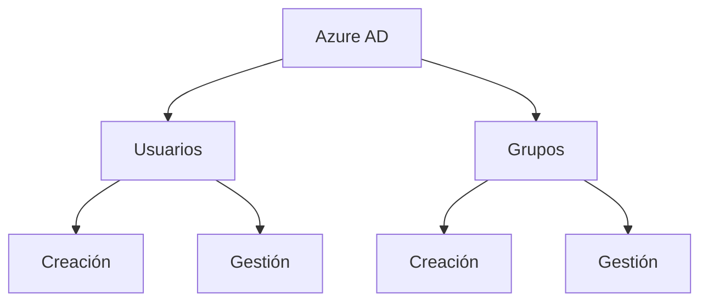
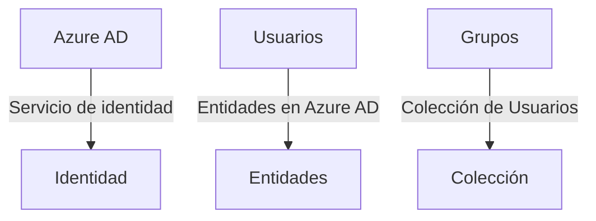
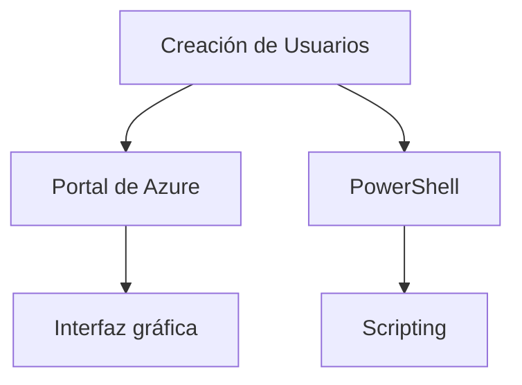
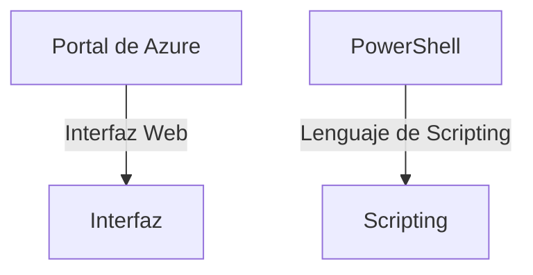
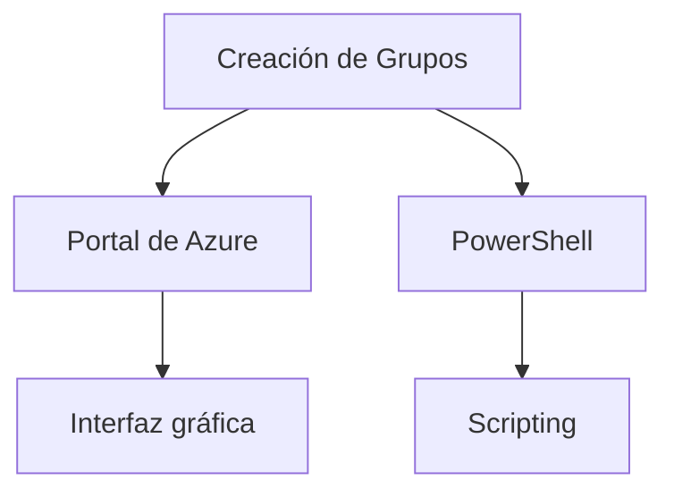
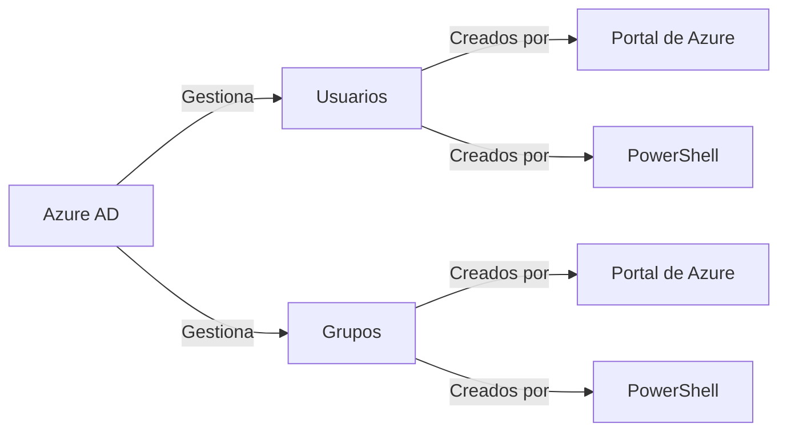

# Crear Usuarios y Grupos en Azure AD (Azure Active Directory)

## Introducción

Azure Active Directory (Azure AD) es un servicio de identidad en la nube que proporciona capacidades de gestión de identidad y acceso. Una de las tareas fundamentales en la administración de Azure AD es la creación y gestión de usuarios y grupos. Esto es crucial para garantizar que las personas adecuadas tengan el acceso adecuado a los recursos correctos.



**Mini Glosario**



## Creación de Usuarios

Para crear un nuevo usuario en Azure AD, existen diversas formas. Puede hacerlo a través del portal de Azure, mediante PowerShell o a través de la API Graph de Microsoft.

### Portal de Azure

1. Navegue al Portal de Azure.
2. Vaya a "Azure Active Directory".
3. Haga clic en "Usuarios" y luego en "Nuevo usuario".

### PowerShell

Utilice el comando `New-AzADUser` para crear un nuevo usuario.

```powershell
New-AzADUser -UserPrincipalName "user@domain.com" -DisplayName "User Name" -Password "UserPassword"
```



**Mini Glosario**



## Creación de Grupos

La creación de grupos facilita la administración al permitir asignar recursos y permisos a una colección de usuarios en lugar de a usuarios individuales.

### Portal de Azure

1. Navegue al Portal de Azure.
2. Vaya a "Azure Active Directory".
3. Haga clic en "Grupos" y luego en "Nuevo grupo".

### PowerShell

Utilice el comando `New-AzADGroup` para crear un nuevo grupo.

```powershell
New-AzADGroup -DisplayName "Group Name" -MailNickname "GroupMail"
```



**Mini Glosario**


## Cuadro Sinóptico



Al comprender estos aspectos fundamentales de la creación y gestión de usuarios y grupos en Azure AD, estará mejor preparado para administrar efectivamente los recursos y permisos dentro de su entorno de Azure.
