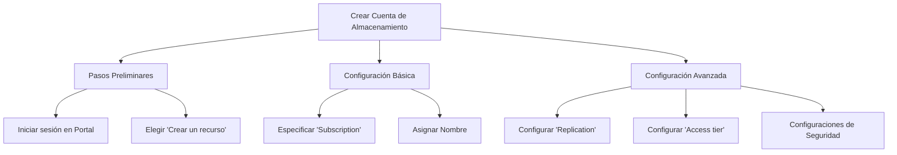
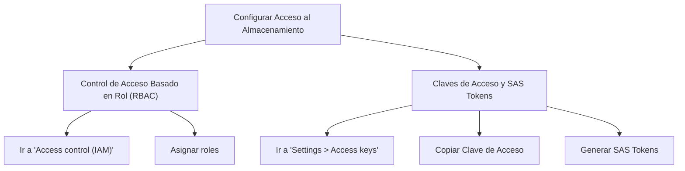

## Crear y Configurar Cuentas de Almacenamiento en Azure

Cuando hablamos de almacenamiento en Azure, nos referimos a una variedad de soluciones diseñadas para guardar y manejar datos. Uno de los primeros pasos para gestionar almacenamiento en Azure es crear y configurar cuentas de almacenamiento. Este espacio proveerá un análisis exhaustivo de cómo llevar a cabo estos procesos.

### Crear una Cuenta de Almacenamiento

#### Pasos Preliminares
1. Inicie sesión en el Portal de Azure.
2. Haga clic en "Crear un recurso", luego elija "Storage" y finalmente "Storage account".

#### Configuración Básica
1. Especifique la "Subscription" y el "Resource group".
2. Asigne un nombre único a la cuenta de almacenamiento.
3. Elija la "Location" más cercana a sus usuarios o servicios.
4. Seleccione el tipo de rendimiento: Estándar o Premium.

#### Configuración Avanzada
1. Configurar "Replication" para alta disponibilidad.
2. Configure la "Access tier" según sus necesidades (hot o cool).
3. Aplicar configuraciones de seguridad como "Azure AD authentication".

```bash
# Ejemplo de cómo crear una cuenta de almacenamiento usando Azure CLI
az storage account create --name MyStorageAccount --resource-group MyResourceGroup --location eastus --sku Standard_LRS
```



| Término               | Definición                                                   |
|----------------------|--------------------------------------------------------------|
| Subscription         | Suscripción de Azure asociada con la cuenta de almacenamiento |
| Resource Group       | Grupo de recursos que contiene recursos de Azure relacionados |
| Location             | Ubicación geográfica del centro de datos de Azure             |
| Standard / Premium   | Tipos de rendimiento para la cuenta de almacenamiento         |
| Replication          | Opciones para replicar datos para alta disponibilidad        |
| Access Tier          | Niveles de acceso para datos (hot, cool)                     |
| Azure AD Authentication | Autenticación mediante Azure Active Directory |

### Configurar el Acceso al Almacenamiento

#### Control de Acceso Basado en Rol (RBAC)
1. Vaya a la cuenta de almacenamiento que desea configurar.
2. Haga clic en "Access control (IAM)".
3. Asigne roles como "Storage Blob Data Contributor" según necesidades.

#### Claves de Acceso y SAS Tokens
1. Vaya a "Settings" > "Access keys".
2. Copie una de las dos claves de acceso para usar en aplicaciones.
3. Generar SAS Tokens para acceso temporal a recursos.

```bash
# Ejemplo de cómo asignar un rol usando Azure CLI
az role assignment create --assignee user@example.com --role "Storage Blob Data Contributor" --scope /subscriptions/{SubID}/resourceGroups/{ResourceGroupName}/providers/Microsoft.Storage/storageAccounts/{StorageAccount}
```



| Término               | Definición                                                   |
|----------------------|--------------------------------------------------------------|
| RBAC                 | Control de Acceso Basado en Rol para permisos                 |
| Access control (IAM) | Interfaz para administrar el control de acceso                |
| Storage Blob Data Contributor | Rol que permite leer, escribir y eliminar blobs en un contenedor de almacenamiento de Azure |
| Access keys          | Claves para acceder al almacenamiento                         |
| SAS Tokens           | Tokens para acceso seguro y temporal a recursos               |

### Cuadro Sinóptico

| Sección                          | Tareas Principales                               | Herramientas y Servicios   |
|----------------------------------|--------------------------------------------------|----------------------------|
| Crear Cuenta de Almacenamiento   | Especificar Subscription, Asignar Nombre, Configurar Replication | Portal de Azure, Azure CLI |
| Configurar Acceso al Almacenamiento | Asignar roles mediante RBAC, Usar claves de acceso y SAS tokens | Access control (IAM), Settings > Access keys  |

Cubriendo estos aspectos, estarás mejor preparado para implementar y administrar el almacenamiento en Azure de forma efectiva. Hay muchas alternativas y opciones para personalizar tus recursos según tus necesidades específicas.
