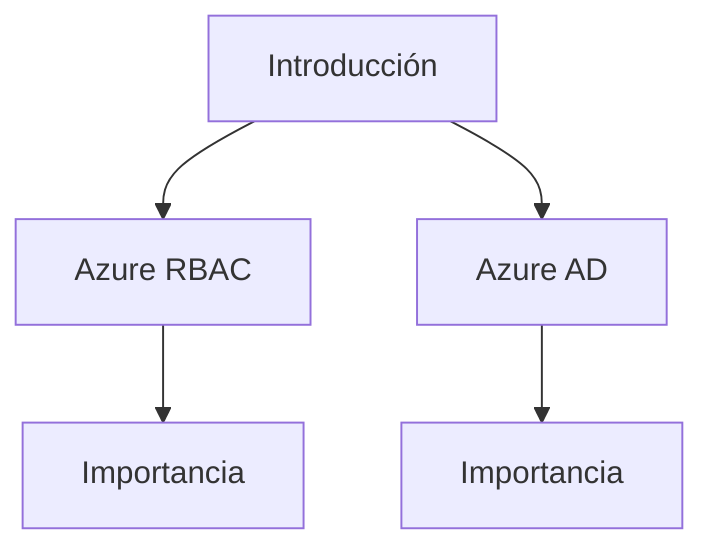
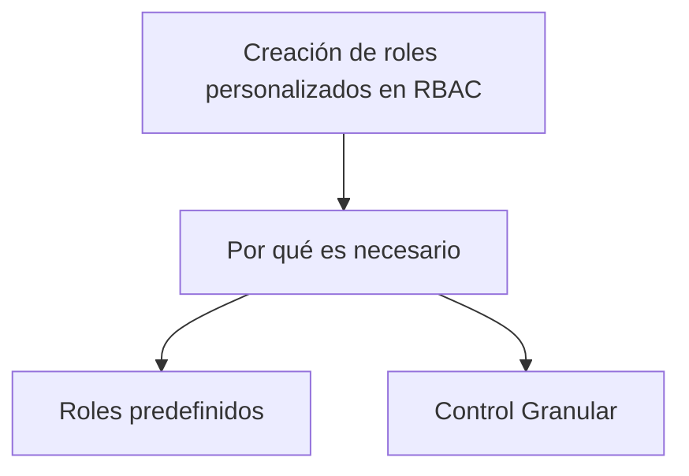
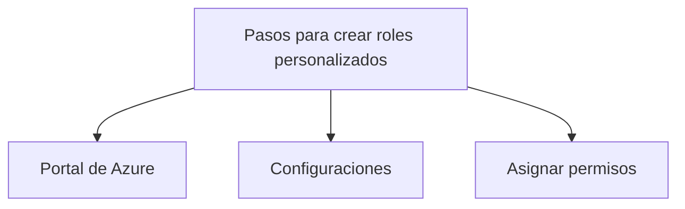
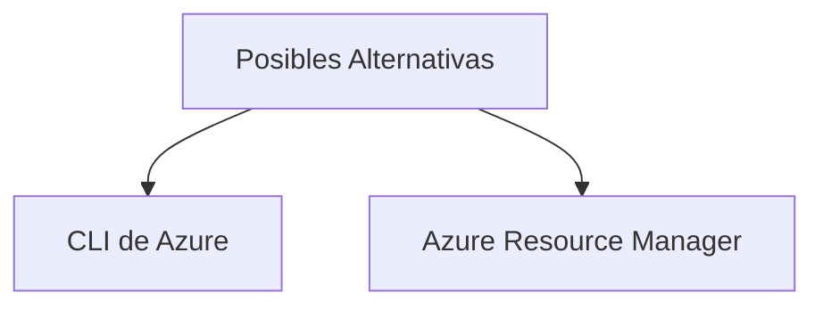
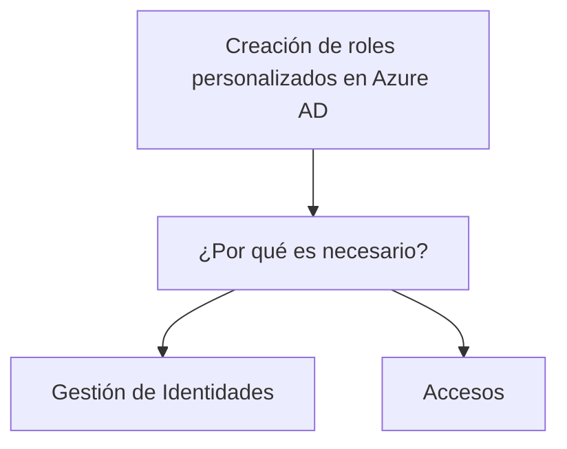
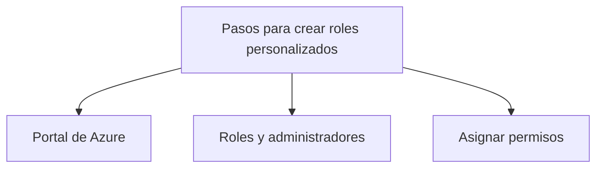

# Crear roles personalizados de control de acceso basado en roles (RBAC) y roles de Azure AD

## Introducción

El control de acceso es un componente crucial para garantizar la seguridad y la gestión eficaz de cualquier infraestructura en la nube. Azure ofrece un sistema robusto llamado Role-Based Access Control (RBAC) junto con Azure Active Directory (AD) para manejar roles y permisos. Esta guía cubrirá cómo crear roles personalizados en RBAC y Azure AD.



### Glosario

| Término        | Descripción                                                                 |
|----------------|-----------------------------------------------------------------------------|
| RBAC           | Control de Acceso Basado en Roles                                            |
| Azure AD       | Azure Active Directory                                                      |
| Permiso        | Autorización para realizar una acción específica                             |
| Rol            | Un conjunto de permisos                                                      |


## Creación de roles personalizados en RBAC

### ¿Por qué es necesario?

La creación de roles personalizados es vital cuando los roles predefinidos no satisfacen las necesidades específicas de tu organización. Permite un control más granular sobre los recursos.



### Pasos para crear roles personalizados

1. Abre el portal de Azure y navega hasta la sección `Roles` bajo `Identity and Access`.
2. Selecciona `Add custom role` y proporciona las configuraciones necesarias.
3. Asigna los permisos adecuados y guarda el rol.

```azurecli
az ad sp create-for-rbac --name CustomRole --role Reader --scopes /subscriptions/{subscription-id}/
```



### Posibles Alternativas

Si no deseas utilizar el portal de Azure, también puedes crear roles personalizados utilizando la CLI de Azure o plantillas de Azure Resource Manager (ARM).



## Creación de roles personalizados en Azure AD

### ¿Por qué es necesario?

Al igual que con RBAC, la personalización de roles en Azure AD es crucial para gestionar de forma efectiva las identidades y accesos en tu infraestructura de Azure.



### Pasos para crear roles personalizados

1. Abre el portal de Azure y navega hasta `Azure Active Directory`.
2. Ve a la sección `Roles and administrators`.
3. Crea un nuevo rol y asigna los permisos necesarios.

```azurecli
az ad sp create-for-rbac --name CustomAzureADRole --role CustomRole
```



### Posibles Alternativas

Como en el caso de RBAC, puedes usar la CLI de Azure o plantillas de Azure Resource Manager para crear roles personalizados en Azure AD.


## Cuadro Sinóptico

| Área                                | Importancia                 | Herramientas                         | Posibles Alternativas        |
|-------------------------------------|-----------------------------|-------------------------------------|------------------------------|
| Creación de roles personalizados en RBAC | Control Granular            | Portal de Azure, CLI de Azure        | Azure Resource Manager       |
| Creación de roles personalizados en Azure AD  | Gestión de Identidades y Accesos | Portal de Azure, CLI de Azure        | Azure Resource Manager       |

Espero que esta guía te haya proporcionado una visión completa de cómo crear roles personalizados tanto en RBAC como en Azure AD. Ahora deberías estar mejor equipado para gestionar el control de acceso en tu infraestructura de Azure.
