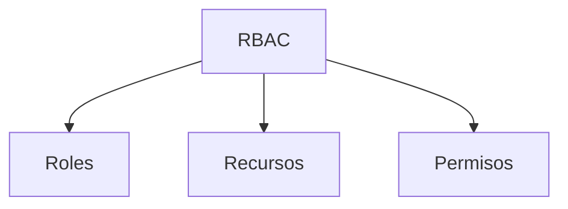
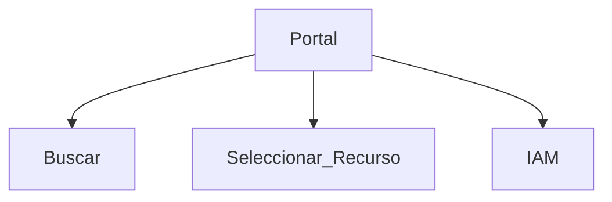
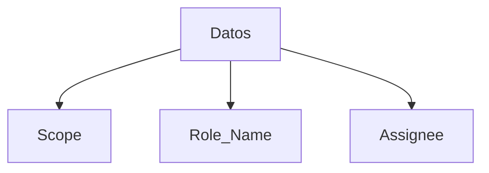
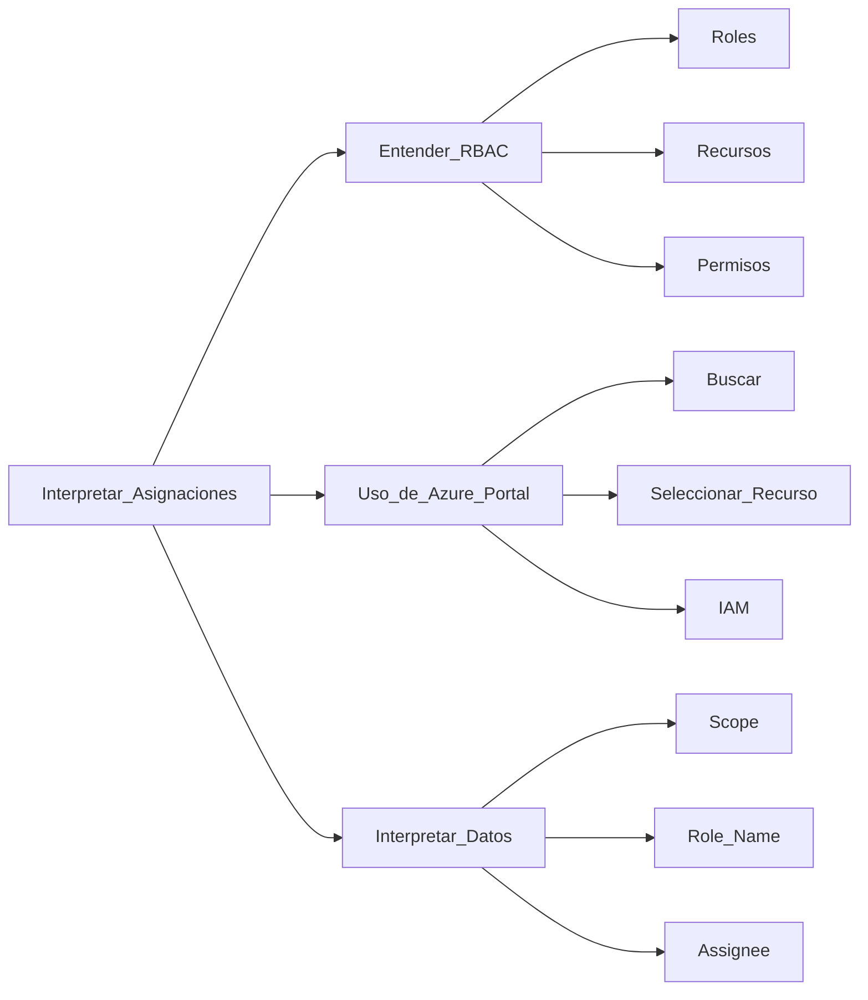

# Interpretar Asignaciones de Acceso en Azure

Azure ofrece un sistema robusto para gestionar el control de acceso a los recursos. Al entender cómo interpretar asignaciones de acceso, los administradores de sistemas pueden tomar decisiones informadas acerca de quién tiene acceso a qué recursos y qué acciones pueden realizar. 

## Entender Role-Based Access Control (RBAC)

### ¿Qué es RBAC?

RBAC o Role-Based Access Control es un sistema que proporciona una manera eficaz de asignar permisos a los usuarios según roles predefinidos.



- **Roles**: Conjuntos de permisos
- **Recursos**: Objetos en Azure a los que se aplica el control de acceso
- **Permisos**: Acciones específicas que un rol puede realizar

### Alternativas a RBAC

1. **Azure Policy**: Para aplicar reglas a nivel de suscripción o recurso.
2. **Identity and Access Management (IAM)**: Para un enfoque más amplio en el manejo de identidades.

## Uso de Azure Portal para Interpretar Asignaciones

### Navegación a través del Portal

Azure Portal ofrece una interfaz gráfica para visualizar y gestionar asignaciones de acceso. 



- **Buscar**: Use la barra de búsqueda para encontrar recursos específicos.
- **Seleccionar Recurso**: Elija el recurso para el que quiere revisar las asignaciones.
- **IAM (Identity and Access Management)**: Sección donde se listan las asignaciones de roles.

### Alternativas a Azure Portal

1. **Azure CLI**: Utilice comandos para gestionar roles.
2. **Azure PowerShell**: Similar a CLI pero con la sintaxis de PowerShell.
3. **APIs de Azure**: Para integraciones automatizadas.

### Ejemplo de código para listar asignaciones con Azure CLI
```bash
az role assignment list --assignee <Nombre_de_usuario_o_ID_de_objeto>
```

## Interpretar Datos de Asignaciones

### Elementos Clave

Es crucial entender ciertos elementos como el `Scope`, `Role Name` y `Assignee` para interpretar correctamente las asignaciones.



- **Scope**: Nivel al cual se aplica el rol (Grupo de recursos, suscripción, etc.)
- **Role Name**: Nombre del rol asignado
- **Assignee**: Usuario o entidad a la que se asigna el rol

---

### Glosario

| Término | Definición |
|---------|------------|
| RBAC    | Control de Acceso Basado en Roles |
| IAM     | Gestión de Identidad y Acceso |
| Scope   | Ámbito o nivel al que se aplica una asignación |
| Assignee| Usuario o entidad que recibe una asignación |

---

### Cuadro Sinóptico


  
Al dominar cómo interpretar asignaciones de acceso en Azure, estará mucho mejor preparado para gestionar recursos de manera efectiva y segura. Es vital comprender las distintas partes del sistema de RBAC, cómo utilizar Azure Portal para inspeccionar asignaciones, y cómo interpretar los datos relacionados con esas asignaciones.
