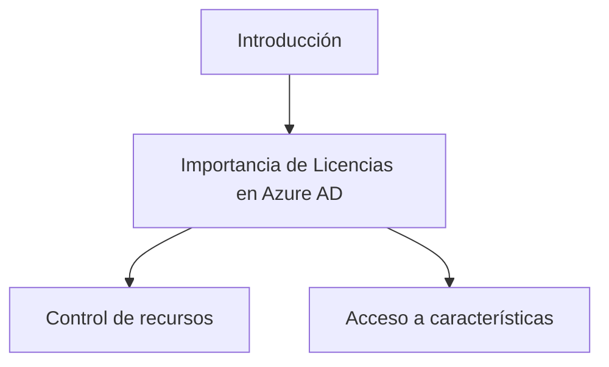
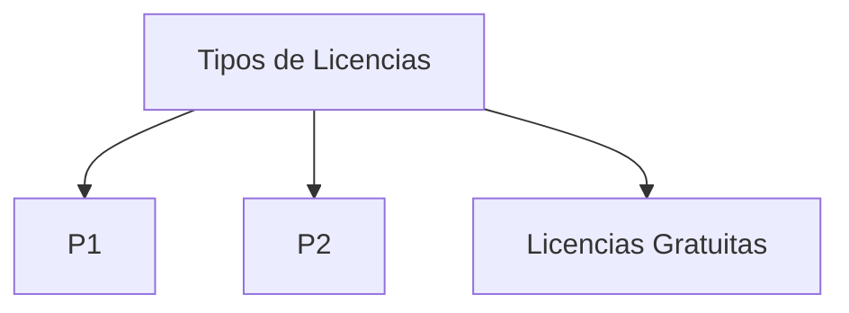
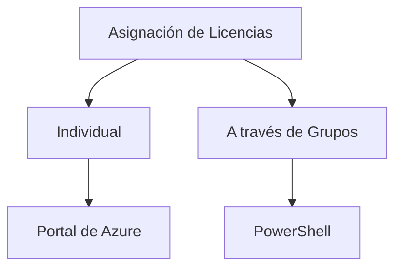
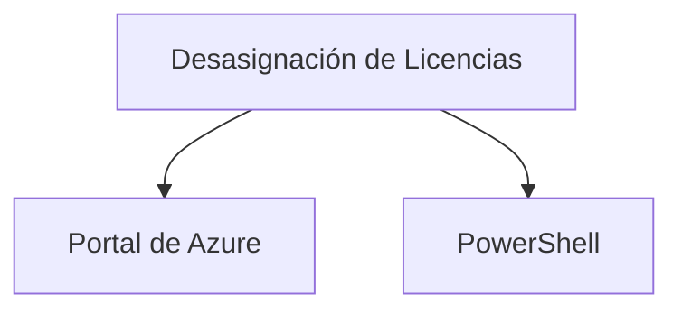
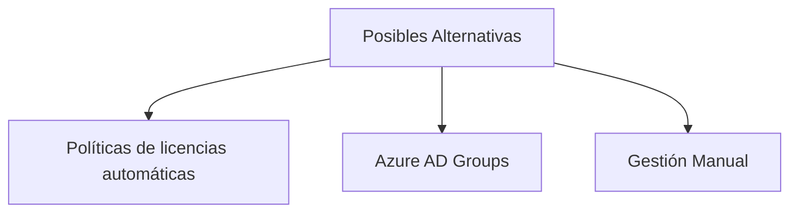

## Manage Licenses in Azure AD

### Introducción
Azure Active Directory (Azure AD) proporciona diversas opciones para gestionar licencias de usuario. La administración de licencias en Azure AD no solo es esencial para controlar los recursos y las capacidades, sino que también permite el acceso a características específicas dentro de los servicios de Azure.



```mermaid
graph TD
  "Importancia de Licencias" --> "Relevancia de tener licencias apropiadas para usuarios"
  "Control de recursos" --> "Capacidad para asignar y desasignar recursos en Azure"
  "Acceso a características" --> "Permite el acceso a funcionalidades específicas en Azure"
```

### Tipos de Licencias

Azure AD ofrece varios tipos de licencias como P1, P2, y licencias gratuitas. Cada tipo de licencia proporciona un conjunto diferente de capacidades y características.



**Código de Ejemplo**
```powershell
# Listar todas las licencias disponibles en Azure AD
Get-AzureADSubscribedSku
```

```mermaid
graph TD
  "P1" --> "Licencia Premium con funcionalidades extendidas"
  "P2" --> "Licencia Premium con todas las capacidades"
  "Licencias Gratuitas" --> "Funcionalidades básicas sin costo"
```

### Asignación de Licencias

Azure AD permite asignar licencias a usuarios de forma individual o a través de grupos. Esta asignación se puede realizar a través del portal de Azure o mediante PowerShell.



**Código de Ejemplo**
```powershell
# Asignar una licencia a un usuario específico en Azure AD
Set-AzureADUserLicense -ObjectId <UserObjectID> -AssignedLicenses $assignedLicenses
```

```mermaid
graph TD
  "Individual" --> "Asignar licencia a un único usuario"
  "A través de Grupos" --> "Asignar licencias a múltiples usuarios mediante grupos"
  "Portal de Azure" --> "Interfaz gráfica para administrar Azure"
  "PowerShell" --> "Lenguaje de script para la administración de Azure"
```

### Desasignación de Licencias

De manera similar a la asignación, las licencias también pueden ser desasignadas. La desasignación ayuda a liberar licencias no utilizadas y a redistribuir recursos.



**Código de Ejemplo**
```powershell
# Desasignar una licencia de un usuario específico
Set-AzureADUserLicense -ObjectId <UserObjectID> -RemoveLicenses $licenseToRemove
```

```mermaid
graph TD
  "Portal de Azure" --> "Interfaz gráfica para administrar Azure"
  "PowerShell" --> "Lenguaje de script para desasignar licencias"
```

### Cuadro Sinóptico

| Sección                 | Detalle                                        |
|------------------------|------------------------------------------------|
| Introducción            | Importancia de la administración de licencias  |
| Tipos de Licencias      | P1, P2, Licencias Gratuitas                    |
| Asignación de Licencias | Individual, A través de Grupos                 |
| Desasignación           | Portal de Azure, PowerShell                    |

### Posibles Alternativas

1. Uso de políticas de licencias automáticas: Permiten asignar licencias basadas en condiciones específicas.
2. Azure AD Groups: Usar grupos de Azure AD para asignar licencias a múltiples usuarios al mismo tiempo.
3. Gestión manual: La asignación y desasignación manual de licencias a través del portal.



```mermaid
graph TD
  "Políticas de licencias automáticas" --> "Asignar licencias basadas en condiciones"
  "Azure AD Groups" --> "Usar grupos para asignación masiva"
  "Gestión Manual" --> "Asignación y desasignación individual"
```
