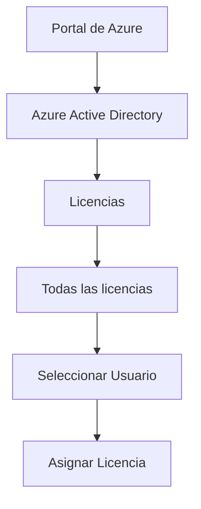
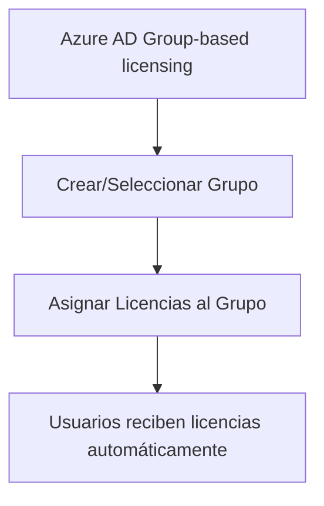
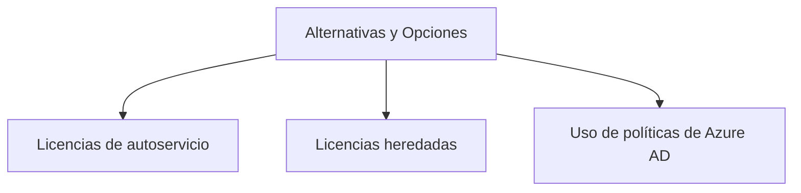

### Manage licenses in Azure AD

El manejo de licencias en Azure Active Directory (Azure AD) es un aspecto fundamental en la administración de identidades y gobernanza en la nube de Microsoft Azure. Este tema abarca desde cómo asignar licencias a los usuarios hasta la automatización de este proceso mediante Azure AD Group-based licensing. Vamos a desglosar los elementos clave para que comprendas mejor cada aspecto.

#### Asignar Licencias a Usuarios Manualmente

Para asignar licencias a usuarios de manera manual, primero es necesario ir al portal de Azure y navegar hasta `Azure Active Directory` > `Licencias` > `Todas las licencias`. Desde aquí, puedes seleccionar el usuario y la licencia correspondiente.



| Término                    | Definición                                                   |
|----------------------------|--------------------------------------------------------------|
| Portal de Azure            | Interfaz web para gestionar recursos de Azure.               |
| Azure Active Directory     | Servicio de gestión de identidades en la nube de Microsoft.  |
| Licencias                  | Sección donde se manejan las licencias en Azure AD.          |
| Todas las licencias        | Lista de todas las licencias disponibles.                    |
| Seleccionar Usuario        | Acción de escoger un usuario específico.                     |
| Asignar Licencia           | Acción de añadir una licencia a un usuario seleccionado.     |

#### Automatización con Group-based Licensing

Si tienes un gran número de usuarios, la asignación manual de licencias puede no ser práctica. En este caso, puedes utilizar Azure AD Group-based licensing para automatizar el proceso.



| Término                           | Definición                                               |
|-----------------------------------|----------------------------------------------------------|
| Azure AD Group-based licensing    | Característica para asignar licencias a grupos de usuarios. |
| Crear/Seleccionar Grupo           | Acción de crear o seleccionar un grupo existente en Azure AD. |
| Asignar Licencias al Grupo        | Acción de asignar una o más licencias al grupo seleccionado. |
| Usuarios reciben licencias automáticamente | Resultado de la asignación de licencias mediante un grupo. |

##### Código de Ejemplo para Automatización

```powershell
# Crear un nuevo grupo en Azure AD
New-AzureADGroup -DisplayName "LicenciaGrupo" -MailEnabled $false -SecurityEnabled $true -MailNickName "NoEmail"

# Asignar una licencia al grupo
$group = Get-AzureADGroup -SearchString "LicenciaGrupo"
$license = New-Object -TypeName Microsoft.Open.AzureAD.Model.AssignedLicense
$license.SkuId = (Get-AzureADSubscribedSku | Where-Object -Property SkuPartNumber -Value "ENTERPRISEPACK" -EQ).ObjectId
Set-AzureADGroup -ObjectId $group.ObjectId -AssignedLicenses $license
```

#### Alternativas y Opciones

- **Licencias de autoservicio**: Permite que los usuarios se asignen licencias ellos mismos.
- **Licencias heredadas de una organización matriz**: Si tu organización forma parte de una más grande, puedes heredar licencias.
- **Uso de políticas de Azure AD**: Puedes establecer políticas para asignar licencias automáticamente según ciertos criterios.



| Término                     | Definición                                               |
|-----------------------------|----------------------------------------------------------|
| Alternativas y Opciones     | Diferentes maneras de manejar licencias en Azure AD.      |
| Licencias de autoservicio   | Opción para que los usuarios se asignen sus propias licencias. |
| Licencias heredadas         | Licencias que se obtienen a través de una organización matriz. |
| Uso de políticas de Azure AD | Establecimiento de reglas para asignar licencias automáticamente. |

### Cuadro Sinóptico

| Aspecto                              | Método Manual                | Automatización               | Alternativas                  |
|--------------------------------------|-----------------------------|------------------------------|-------------------------------|
| **Acción Inicial**                   | Navegar hasta licencias     | Crear/Seleccionar Grupo      | Elegir entre opciones         |
| **Pasos Intermedios**                | Seleccionar Usuario         | Asignar Licencias al Grupo   | Dependiendo de la alternativa |
| **Resultado**                        | Usuario recibe licencia     | Usuarios reciben automáticamente| Varía                        |
| **Código de Ejemplo**                 | No aplica                   | PowerShell                   | Dependiendo de la alternativa |

Espero que esta explicación te ayude a entender cómo manejar las licencias en Azure AD de una manera más efectiva y eficiente.