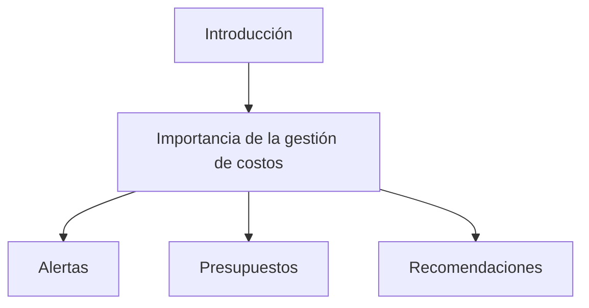
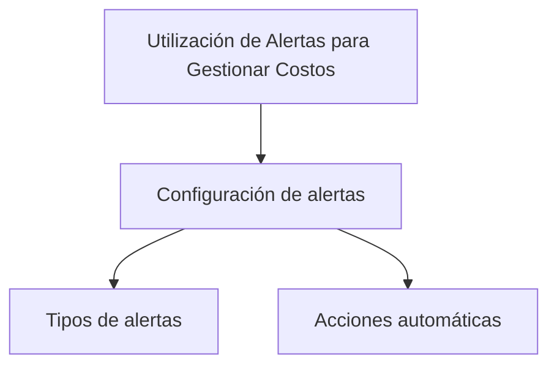
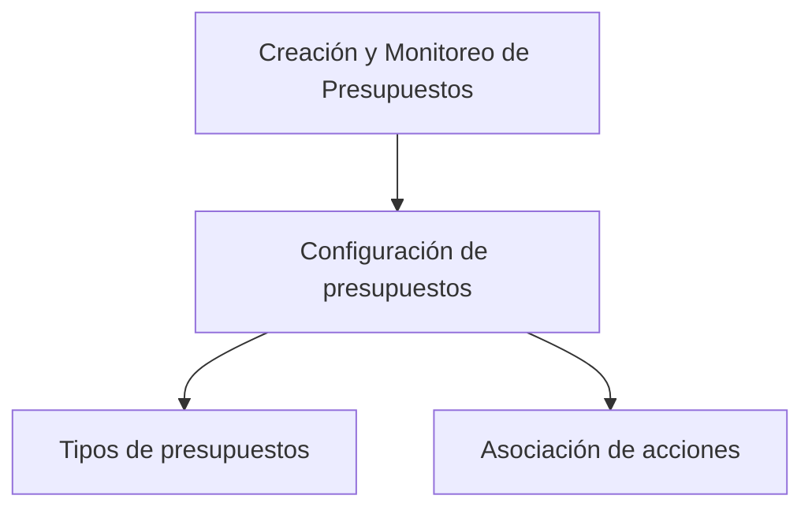
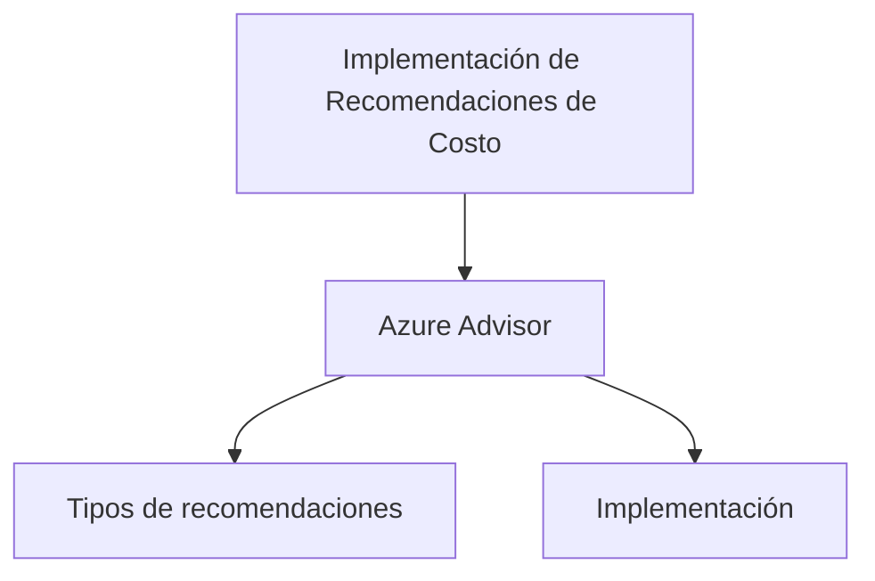

# Manage Costs by Using Alerts, Budgets, and Recommendations

## Introducción

La gestión eficaz de los costos en Azure es crucial para maximizar los recursos sin exceder el presupuesto. En este contexto, vamos a explorar cómo utilizar alertas, presupuestos y recomendaciones para gestionar costos de manera efectiva.



---

## Utilización de Alertas para Gestionar Costos

Las alertas de costo en Azure te permiten recibir notificaciones cuando los gastos se acercan o superan un límite específico. Este sistema proactivo te ayuda a evitar sorpresas en la facturación.



### Ejemplo de Código para Configuración de Alertas

```json
{
  "name": "MyCostAlert",
  "type": "Microsoft.CostManagement/alerts",
  "apiVersion": "2020-06-01",
  "properties": {
    "category": "Cost",
    "criteria": {
      "type": "ActualTotal",
      "dimensionName": "ChargeType",
      "operator": "In",
      "values": [
        "Usage",
        "Purchase"
      ]
    },
    "threshold": 100,
    "timePeriod": {
      "type": "SinceActivation",
      "grain": "Monthly"
    }
  }
}
```

---

## Creación y Monitoreo de Presupuestos

Los presupuestos en Azure te permiten establecer límites de gastos y recibir notificaciones cuando los alcanzas. Además, puedes asociar acciones automáticas a estos límites para optimizar los recursos.



---

## Implementación de Recomendaciones de Costo

Azure Advisor proporciona recomendaciones específicas para reducir los costos. Puedes implementar estas recomendaciones directamente desde el panel de Azure.



---

| Término                     | Definición                                                                                      |
|-----------------------------|------------------------------------------------------------------------------------------------|
| Alertas                     | Notificaciones que se activan cuando los costos alcanzan un cierto umbral.                      |
| Presupuestos                | Límites de gasto que puedes establecer en Azure para controlar los costos.                      |
| Azure Advisor               | Herramienta que ofrece recomendaciones personalizadas para optimizar los recursos y reducir costos. |

---

## Cuadro Sinóptico

| Área                        | Componente               | Funcionalidad                                         | Herramientas relacionadas        |
|-----------------------------|--------------------------|--------------------------------------------------------|----------------------------------|
| Gestión de Costos           | Alertas                  | Notificación de gastos cercanos o superados            | JSON, Azure Portal               |
|                             | Presupuestos             | Establecer límites de gasto                            | Azure Portal                     |
|                             | Recomendaciones          | Sugerencias para reducir gastos                        | Azure Advisor                    |

Espero que esta información te sea útil para entender cómo gestionar los costos en Azure mediante el uso de alertas, presupuestos y recomendaciones.
