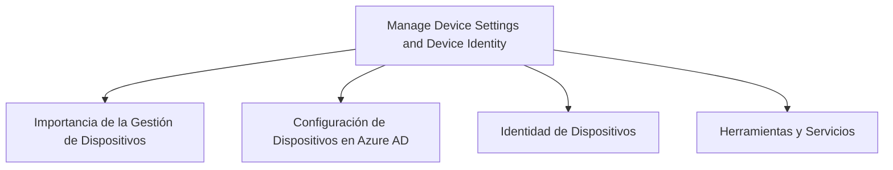
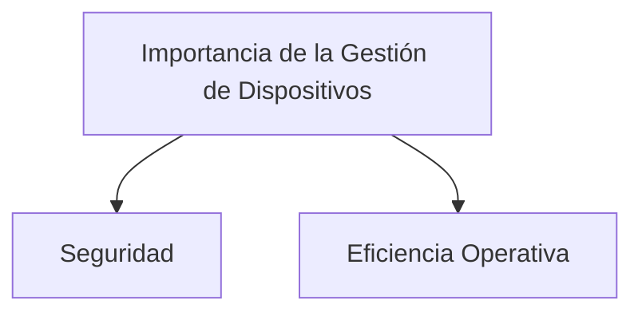
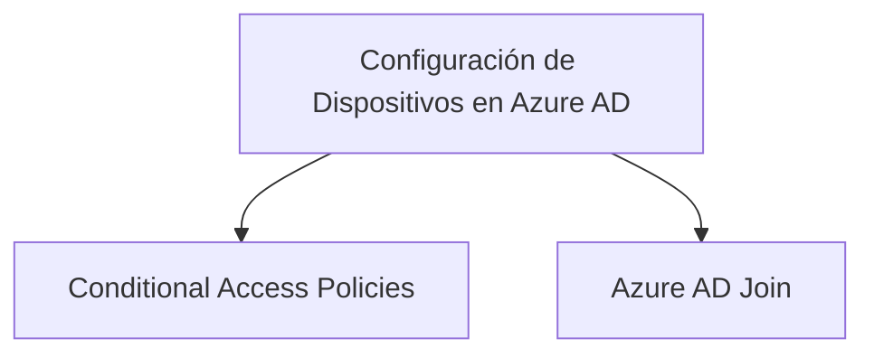
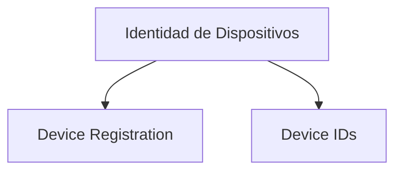
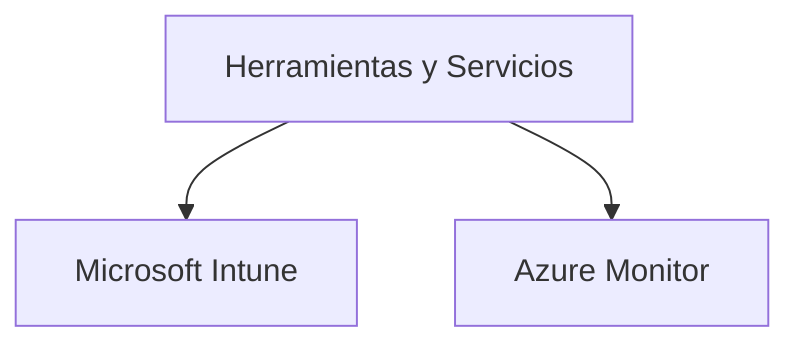
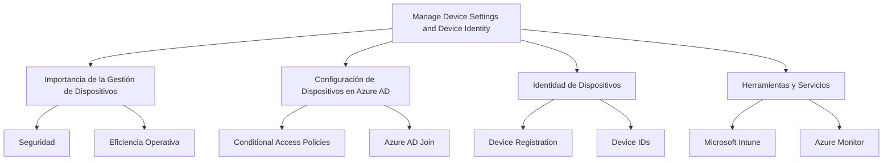

# Manage Device Settings and Device Identity en Azure AD

## Introducción

La identidad y la gestión de dispositivos son esenciales para mantener un ambiente seguro y eficiente en Azure. A través del uso de Azure Active Directory (Azure AD), podemos gestionar no solo usuarios y grupos, sino también dispositivos. En este texto se exploran las maneras de gestionar configuraciones de dispositivos e identidad de dispositivos en Azure AD.



---

## Importancia de la Gestión de Dispositivos

Antes de sumergirnos en cómo administrar dispositivos, es crucial entender la importancia de tener un enfoque estructurado para la gestión de dispositivos. La gestión adecuada ayuda a mantener la seguridad y la eficiencia operativa.



| Término | Descripción |
| ------- | ----------- |
| Seguridad | Proteger los recursos de la empresa. |
| Eficiencia Operativa | Optimizar el uso de recursos en Azure. |

---

## Configuración de Dispositivos en Azure AD

Azure AD ofrece diversas formas de configurar dispositivos:

### Conditional Access Policies

Las políticas de acceso condicional permiten definir condiciones bajo las cuales un dispositivo puede acceder a recursos.

### Azure AD Join

Azure AD Join permite unir dispositivos directamente a Azure AD sin la necesidad de un dominio on-premises.



| Término | Descripción |
| ------- | ----------- |
| Conditional Access Policies | Políticas para condiciones de acceso a recursos. |
| Azure AD Join | Unir dispositivos directamente a Azure AD. |

```powershell
# Ejemplo para configurar una política de acceso condicional
New-AzureADMSConditionalAccessPolicy -Name "Ejemplo" -Conditions $condiciones -GrantControls $controles -State "enabled"
```

---

## Identidad de Dispositivos

Cada dispositivo tiene una identidad única que se utiliza para autenticarlo en Azure AD. Las opciones para la identidad de dispositivos incluyen:

### Device Registration

Los dispositivos se pueden registrar en Azure AD para ser gestionados de forma centralizada.

### Device IDs

Identificadores únicos asignados a cada dispositivo.



| Término | Descripción |
| ------- | ----------- |
| Device Registration | Registro centralizado de dispositivos en Azure AD. |
| Device IDs | Identificadores únicos para cada dispositivo. |

```powershell
# Ejemplo para registrar un dispositivo en Azure AD
Register-AzureADDevice -DeviceId "ID_del_dispositivo"
```

---

## Herramientas y Servicios

Varias herramientas y servicios pueden ayudar en la gestión de dispositivos en Azure AD, incluyendo Microsoft Intune y Azure Monitor.



| Término | Descripción |
| ------- | ----------- |
| Microsoft Intune | Servicio para la gestión de dispositivos móviles. |
| Azure Monitor | Monitoreo y análisis de rendimiento de dispositivos. |

---

## Cuadro Sinóptico



Este texto ofrece una visión completa de cómo manejar las configuraciones de dispositivos y la identidad de dispositivos en Azure AD, desde la importancia de una correcta gestión hasta las herramientas y servicios que puedes utilizar para implementarla de manera efectiva.
