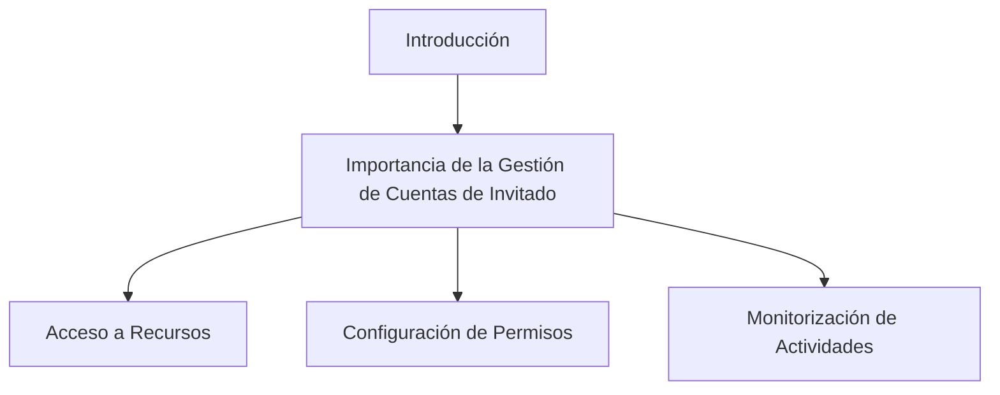
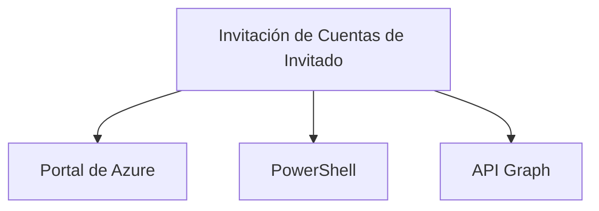
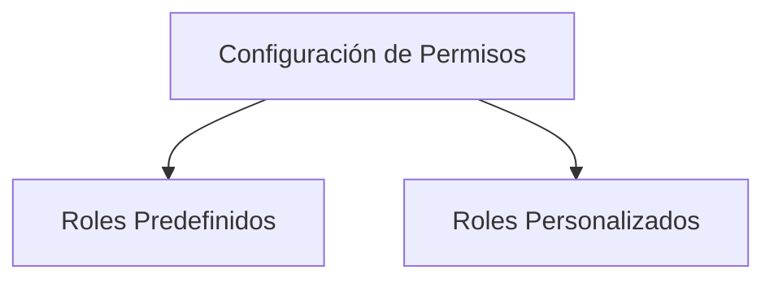
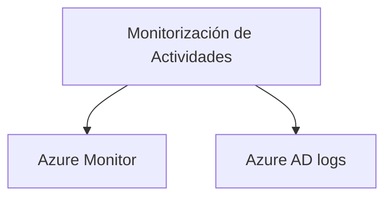
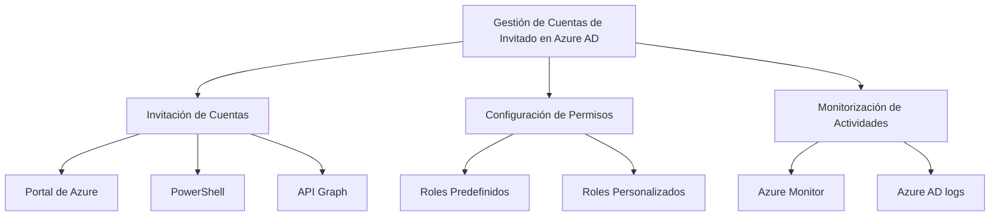

## Gestionar Cuentas de Invitado en Azure AD

### Introducción

La gestión de cuentas de invitado en Azure Active Directory (Azure AD) es un componente crucial para garantizar que los usuarios externos tengan el acceso adecuado a los recursos de tu organización. Este proceso abarca desde la invitación de cuentas hasta la configuración de permisos y la monitorización de la actividad del usuario.



**Glosario**

| Término                  | Descripción                                           |
|-------------------------|-------------------------------------------------------|
| Azure AD                | Azure Active Directory, el servicio de directorio de Microsoft Azure. |
| Cuenta de Invitado      | Un tipo de cuenta de usuario que permite el acceso a usuarios externos.  |
| Permisos                | Autorizaciones dadas a un usuario para acceder a recursos.   |
| Monitorización          | Supervisión de la actividad de un usuario dentro de un sistema. |

---

### Invitación de Cuentas de Invitado

Invitar a un usuario como invitado a tu Azure AD es el primer paso en la gestión de cuentas de invitado. Puedes hacerlo desde el portal de Azure, mediante PowerShell o a través de la API Graph.



**Código de Ejemplo en PowerShell**

```powershell
# Invitación de un usuario como invitado en Azure AD
New-AzureADMSInvitation -InvitedUserEmailAddress "correo@dominio.com" -InviteRedirectUrl "https://miapp.com"
```

**Glosario**

| Término                  | Descripción                                           |
|-------------------------|-------------------------------------------------------|
| Portal de Azure         | Interfaz gráfica para gestionar servicios de Azure.   |
| PowerShell              | Lenguaje de scripting para administración de sistemas.|
| API Graph               | Interfaz de programación para interactuar con Azure AD.|

---

### Configuración de Permisos

La configuración de permisos es vital para asegurarse de que los usuarios invitados tengan el nivel de acceso apropiado. Puedes usar roles predefinidos o crear roles personalizados según las necesidades de tu organización.



**Glosario**

| Término                  | Descripción                                           |
|-------------------------|-------------------------------------------------------|
| Roles Predefinidos       | Conjunto de permisos ya configurados por Azure.       |
| Roles Personalizados     | Conjunto de permisos definidos por el usuario.        |

---

### Monitorización de Actividades

Finalmente, es crucial monitorizar la actividad de los usuarios invitados para asegurar el cumplimiento y la seguridad. Puedes hacer uso de Azure Monitor y Azure AD logs para esto.



**Glosario**

| Término                  | Descripción                                           |
|-------------------------|-------------------------------------------------------|
| Azure Monitor           | Servicio para la monitorización de aplicaciones y recursos. |
| Azure AD logs           | Registros de actividad en Azure AD.                    |

---

## Cuadro Sinóptico



Con esto, deberías tener un entendimiento completo sobre cómo gestionar cuentas de invitado en Azure AD, desde la invitación hasta la monitorización.
