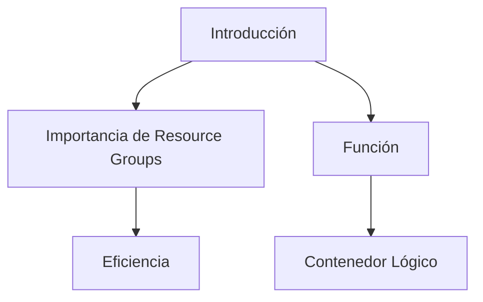
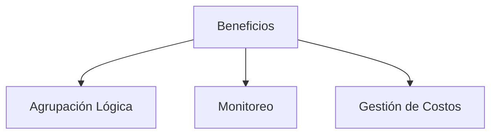
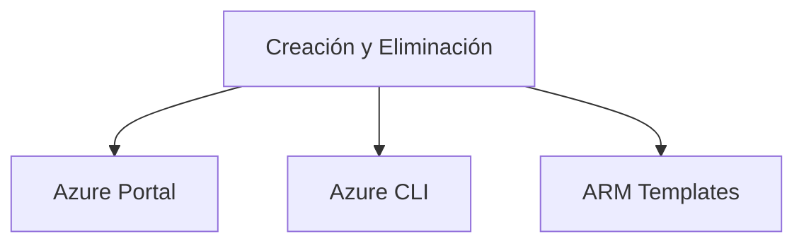
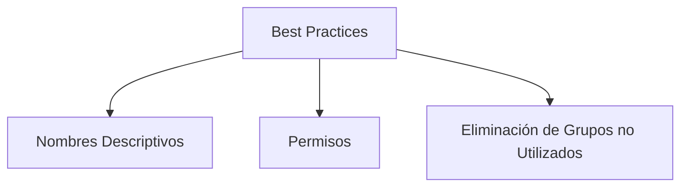

# Manage Resource Groups en Azure

## Introducción
La gestión de los Resource Groups (Grupos de recursos) es fundamental para la administración eficiente de los recursos en Azure. Estos actúan como contenedores lógicos donde los recursos de Azure como máquinas virtuales, bases de datos y demás se almacenan.



| Término             | Definición                                 |
|--------------------|--------------------------------------------|
| Resource Groups    | Contenedores lógicos para recursos en Azure |
| Contenedor Lógico  | Unidad de organización en Azure             |

---

## Beneficios de Usar Resource Groups
Al utilizar Resource Groups, se pueden lograr varios beneficios como la agrupación lógica de recursos, simplificación del monitoreo y gestión de costos.



| Término            | Definición                              |
|--------------------|-----------------------------------------|
| Agrupación Lógica  | Agrupar recursos relacionados           |
| Monitoreo          | Observación y registro del rendimiento  |
| Gestión de Costos  | Control del gasto asociado a los recursos|

---

## Creación y Eliminación de Resource Groups
Puedes crear un Resource Group mediante Azure Portal, Azure CLI o ARM Templates. Para eliminar un Resource Group, los mismos métodos son aplicables.

### Código de Ejemplo para Crear un Resource Group usando Azure CLI
```bash
az group create --name MyResourceGroup --location eastus
```



| Término        | Definición                                         |
|----------------|----------------------------------------------------|
| Azure Portal   | Interfaz web para gestionar servicios de Azure     |
| Azure CLI      | Línea de comandos para gestionar servicios de Azure|
| ARM Templates  | Plantillas para automatizar despliegues           |

---

## Best Practices
Es recomendable seguir algunas mejores prácticas como usar nombres descriptivos, establecer permisos y políticas adecuadas y eliminar los grupos de recursos no utilizados.



| Término                       | Definición                              |
|-------------------------------|-----------------------------------------|
| Nombres Descriptivos          | Nombres que reflejan la función del grupo|
| Permisos                      | Reglas de acceso a los recursos         |
| Eliminación de Grupos no Usados| Borrar grupos que no se utilizan para evitar costos|

---

## Cuadro Sinóptico

| Concepto           | Detalle                                   | Herramientas/Métodos       |
|--------------------|--------------------------------------------|----------------------------|
| Importancia        | Eficiencia, Contenedor Lógico               | N/A                        |
| Beneficios         | Agrupación Lógica, Monitoreo, Gestión de Costos | N/A                    |
| Creación/Eliminación| Mediante Azure Portal, Azure CLI, ARM Templates | Azure Portal, Azure CLI, ARM Templates |
| Best Practices     | Nombres Descriptivos, Permisos, Eliminación de Grupos no Utilizados | N/A |

De este modo, se cubren los aspectos esenciales para la gestión de Resource Groups en Azure, que son críticos para la administración efectiva de cualquier ambiente en la nube.
