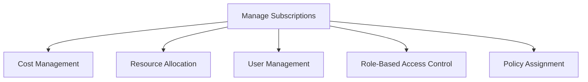
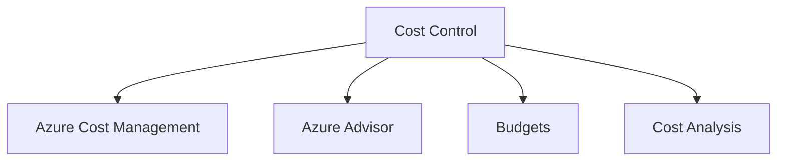
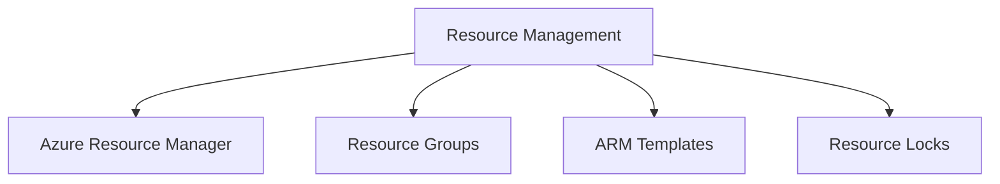
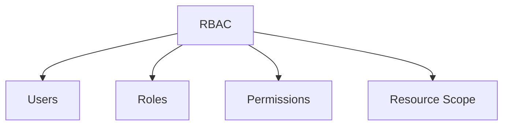
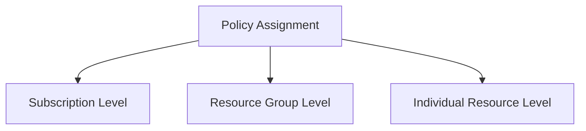
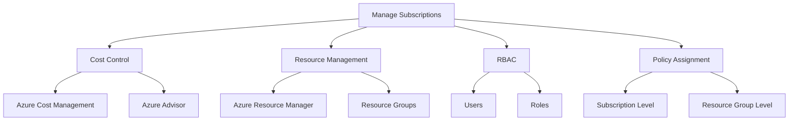

### Manage Subscriptions

Cuando trabajamos con Microsoft Azure, la gestión de suscripciones es un componente esencial para asegurar el correcto despliegue y mantenimiento de los recursos. Esta gestión nos ayuda a administrar costos, recursos y usuarios de manera eficiente.

**Sin título**

| Término | Descripción |
|---------|-------------|
| Manage Subscriptions | Proceso de administración y control de suscripciones en Azure. |
| Cost Management | Supervisión y administración de costos asociados. |
| Resource Allocation | Distribución y asignación de recursos dentro de la suscripción. |
| User Management | Administración de usuarios que tienen acceso a la suscripción. |
| Role-Based Access Control | Control de acceso basado en roles. |
| Policy Assignment | Asignación de políticas para recursos dentro de la suscripción. |

#### Control de Costos

En Azure, es posible mantener un control estricto sobre los costos a través de diversas herramientas como Azure Cost Management y Azure Advisor. Estas herramientas ofrecen insights en tiempo real sobre el gasto, y brindan recomendaciones para optimizar los recursos.

**Sin título**

| Término | Descripción |
|---------|-------------|
| Cost Control | Gestión y control del gasto en Azure. |
| Azure Cost Management | Herramienta para la administración de costos. |
| Azure Advisor | Ofrece recomendaciones para optimizar recursos. |
| Budgets | Presupuestos para controlar gastos. |
| Cost Analysis | Análisis detallado de los costos incurridos. |

#### Administración de Recursos

La administración de recursos en una suscripción de Azure puede hacerse a través de Azure Resource Manager, que permite agrupar, organizar y administrar recursos de manera efectiva. Puedes utilizar plantillas ARM para automatizar el despliegue de recursos.

**Sin título**

| Término | Descripción |
|---------|-------------|
| Resource Management | Gestión de recursos en la suscripción. |
| Azure Resource Manager | Plataforma para la administración de recursos. |
| Resource Groups | Agrupaciones de recursos. |
| ARM Templates | Plantillas para el despliegue automático de recursos. |
| Resource Locks | Bloqueos para prevenir cambios accidentales. |

#### Control de Acceso Basado en Roles (Role-Based Access Control, RBAC)

Azure RBAC permite asignar permisos específicos a usuarios, grupos y aplicaciones, dependiendo de sus roles dentro de la organización. Este control de acceso es crucial para mantener la seguridad y la integridad de los recursos de Azure.

**Sin título**

| Término | Descripción |
|---------|-------------|
| RBAC | Control de acceso basado en roles. |
| Users | Usuarios que acceden a los recursos. |
| Roles | Roles asignados a los usuarios. |
| Permissions | Permisos otorgados o denegados. |
| Resource Scope | Ámbito del recurso al que se aplica el RBAC. |

#### Asignación de Políticas

Puedes asignar políticas a nivel de suscripción, grupo de recursos o recurso individual para garantizar que los recursos cumplan con ciertos requisitos y normativas.

**Sin título**

| Término | Descripción |
|---------|-------------|
| Policy Assignment | Asignación de políticas a recursos. |
| Subscription Level | Nivel de suscripción. |
| Resource Group Level | Nivel de grupo de recursos. |
| Individual Resource Level | Nivel de recurso individual. |

### Cuadro Sinóptico

Espero que esta información te sea útil para manejar eficientemente las suscripciones en Azure y que te ayude a prepararte para tu examen AZ-104.
