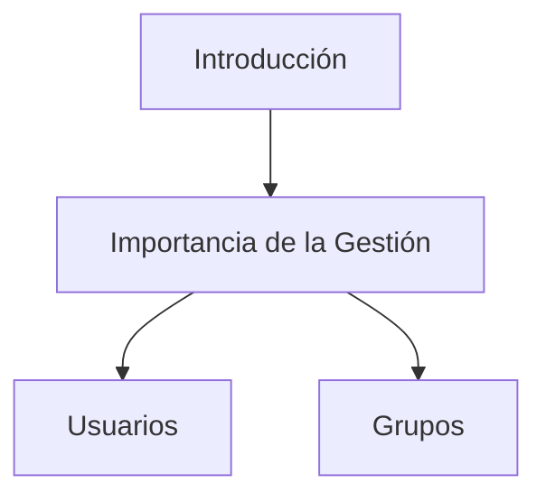
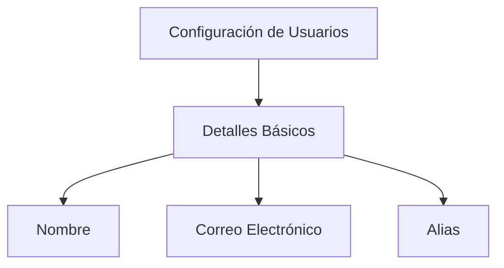
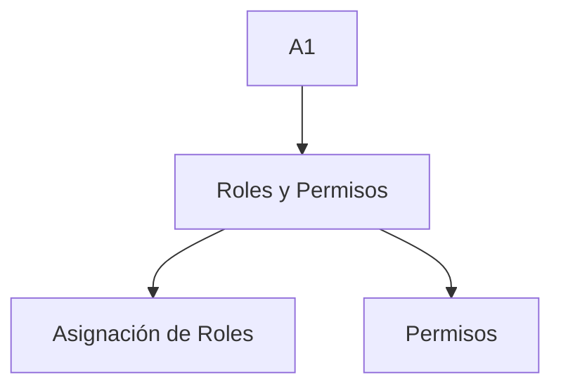
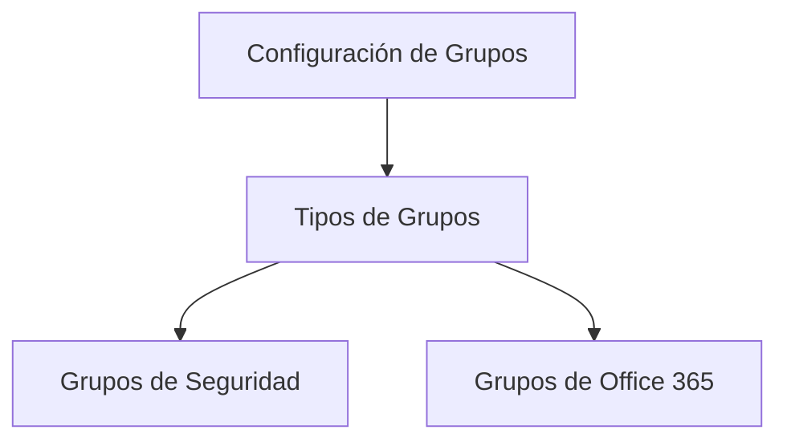
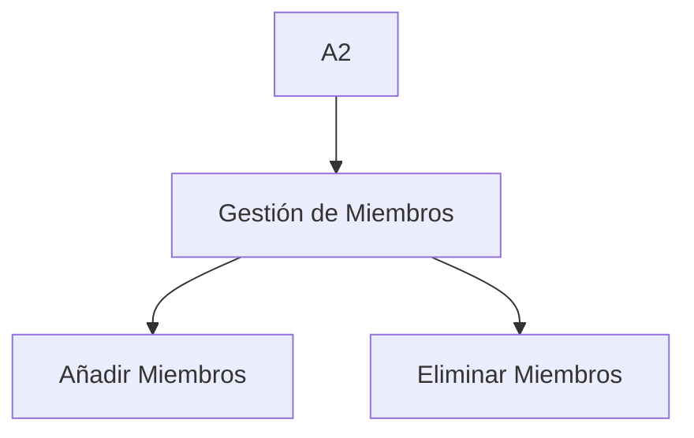
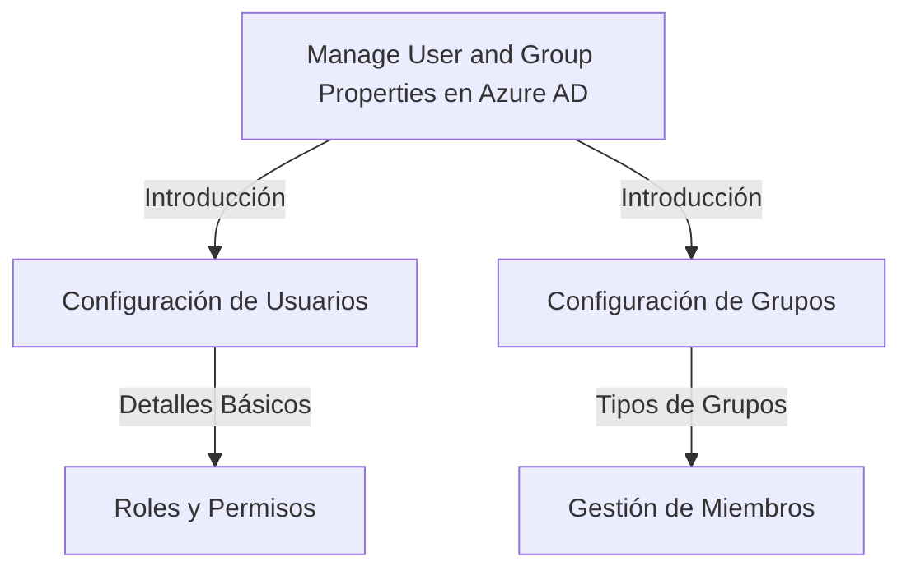

# Manage User and Group Properties en Azure AD

## Introducción

Cuando trabajas con Azure AD (Azure Active Directory), gestionar las propiedades de usuarios y grupos es fundamental para la administración de identidades y acceso. En esta sección, aprenderás cómo gestionar diversas propiedades que incluyen pero no están limitadas a la configuración de usuarios, asignación de roles y configuración de grupos.



---

### Configuración de Usuarios

En Azure AD, puedes gestionar una serie de propiedades para los usuarios. Esto va desde simples detalles como el nombre y la dirección de correo electrónico, hasta configuraciones más avanzadas como la asignación de roles y permisos.

#### Detalles Básicos



**Ejemplo de Código**

```powershell
# Añadir un nuevo usuario en Azure AD
New-AzureADUser -DisplayName "John Doe" -PasswordProfile $passwordProfile -UserPrincipalName "john.doe@example.com" -MailNickName "john.doe"
```

#### Roles y Permisos



**Ejemplo de Código**

```powershell
# Asignar un rol de usuario a un usuario existente
Add-AzureADUserRoleMember -ObjectId <ObjectID> -RefObjectId <RefObjectID>
```

---

### Configuración de Grupos

Los grupos en Azure AD permiten una gestión más eficaz al agrupar múltiples usuarios bajo una misma entidad. Esto facilita asignar permisos y roles en bloque.

#### Tipos de Grupos



**Ejemplo de Código**

```powershell
# Crear un nuevo grupo de seguridad
New-AzureADGroup -DisplayName "SecurityGroup1" -SecurityEnabled $true -MailEnabled $false -MailNickName "NotSet"
```

#### Gestión de Miembros



**Ejemplo de Código**

```powershell
# Añadir un miembro a un grupo
Add-AzureADGroupMember -ObjectId <GroupObjectID> -RefObjectId <UserObjectID>
```

---

| Término                  | Descripción                                                |
|-------------------------|------------------------------------------------------------|
| Azure AD                | Active Directory de Azure                                  |
| Roles                   | Conjunto de permisos                                       |
| Grupos de Seguridad     | Grupos específicos para políticas de seguridad             |
| Grupos de Office 365    | Grupos usados en la suite de Office 365                    |
| ObjectId                | Identificador único de un objeto en Azure AD               |
| RefObjectId             | Identificador único del objeto referenciado en Azure AD    |

## Cuadro Sinóptico



Es importante que entiendas todas las facetas de la gestión de usuarios y grupos en Azure AD para garantizar una administración efectiva de tu entorno Azure. Considera todas las alternativas y opciones al configurar estas propiedades.
