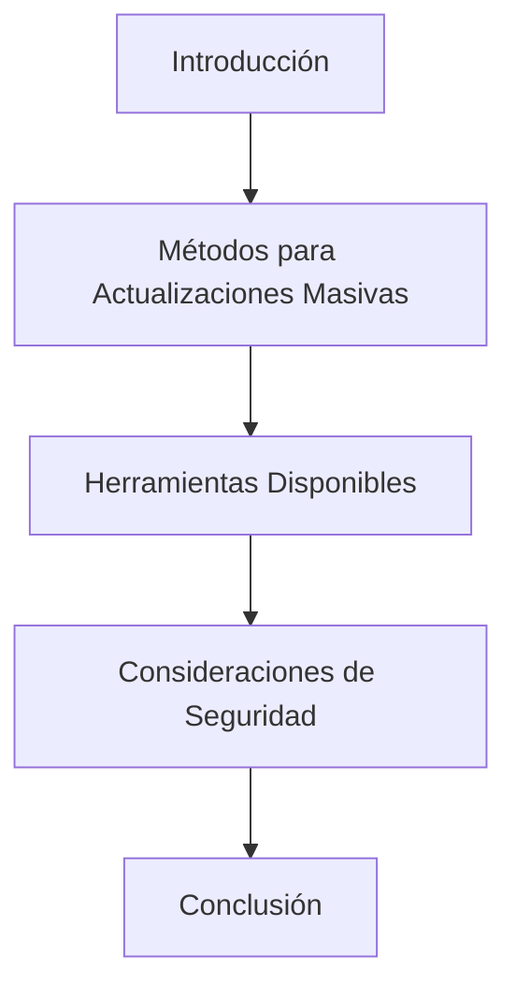
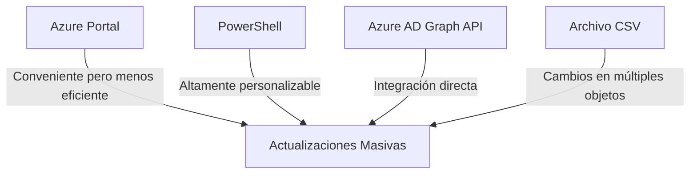
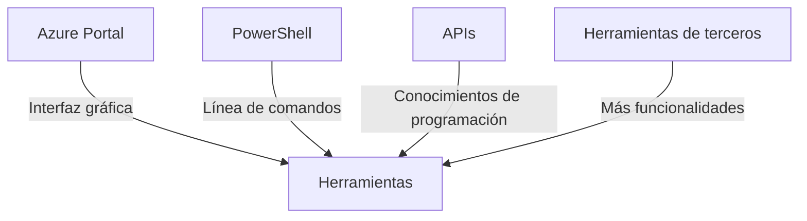
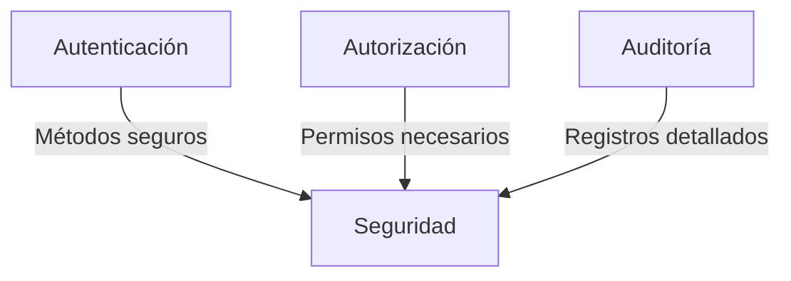
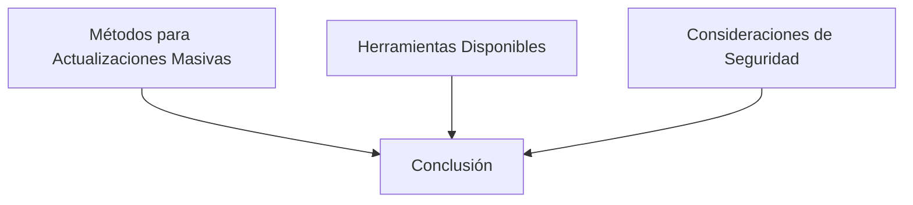

## Realizar Actualizaciones Masivas en Azure AD

### Introducción

Las actualizaciones masivas en Azure Active Directory (Azure AD) son esenciales para gestionar eficientemente grandes cantidades de objetos. Esta función es particularmente útil en situaciones como incorporación masiva de empleados, cambios organizativos y mucho más. A lo largo de este texto, exploraremos diferentes métodos para llevar a cabo estas actualizaciones masivas.



---

### Métodos para Actualizaciones Masivas

Existen varios métodos para realizar actualizaciones masivas en Azure AD:

1. **Azure Portal**: Conveniente pero menos eficiente para muy grandes conjuntos de datos.
2. **PowerShell**: Altamente personalizable y apto para grandes conjuntos de datos.
3. **Azure AD Graph API**: Útil para aplicaciones que requieren integración directa para gestionar objetos de Azure AD.
4. **Archivo CSV**: Subir un archivo CSV para hacer cambios en múltiples objetos a la vez.

#### Código de ejemplo para PowerShell
```powershell
# Importar el módulo AzureAD
Import-Module AzureAD

# Conectar a Azure AD
Connect-AzureAD

# Realizar la actualización masiva
Get-AzureADUser -Filter "Department eq 'Sales'" | Set-AzureADUser -Title 'Sales Executive'
```



---

### Herramientas Disponibles

- **Azure Portal**: Interfaz gráfica, sencilla de usar.
- **PowerShell**: Interfaz de línea de comandos, requiere conocimiento en scripting.
- **APIs**: Requieren conocimientos de programación.
- **Herramientas de terceros**: Soluciones como Okta, que pueden ofrecer más funcionalidades.



---

### Consideraciones de Seguridad

- **Autenticación**: Es fundamental utilizar métodos seguros de autenticación.
- **Autorización**: Asegúrese de tener los permisos necesarios.
- **Auditoría**: Mantenga registros detallados de los cambios realizados.



---

### Conclusión

Las actualizaciones masivas son un componente esencial para la administración eficiente de Azure AD. Al elegir el método y la herramienta adecuados, puede simplificar enormemente este proceso.



---

| Término                  | Definición                                                              |
|--------------------------|-------------------------------------------------------------------------|
| Azure Portal             | Interfaz gráfica de Azure para la administración de recursos.           |
| PowerShell               | Lenguaje de scripting y shell de línea de comandos.                     |
| Azure AD Graph API       | API para la administración de Azure AD.                                 |
| CSV                      | Archivo de valores separados por comas, usado para almacenar datos.      |
| Autenticación            | Proceso de verificación de la identidad.                                |
| Autorización             | Proceso de otorgar o denegar permisos.                                  |
| Auditoría                | Proceso de revisar actividades o transacciones para verificar conformidad|

### Cuadro Sinóptico

| Sección                   | Métodos                   | Herramientas     | Consideraciones de Seguridad  |
|---------------------------|---------------------------|------------------|-------------------------------|
| Métodos para Actualizaciones Masivas  | Azure Portal, PowerShell, Azure AD Graph API, Archivo CSV | Azure Portal, PowerShell, APIs, Herramientas de terceros  | Autenticación, Autorización, Auditoría |
