Ah, entiendo. Puedes tener un gráfico en Mermaid que incluye tanto las opciones en inglés como sus descripciones en castellano como nodos separados. Aquí tienes el diagrama actualizado:

```mermaid
graph TD
    A[Crear Storage Account] --> B1[Subscription]
    A --> B2[Resource Group]
    A --> B3[Nombre de Storage Account]
    A --> B4[Location]
    A --> B5[Performance]
    A --> B6[Account Kind]
    A --> B7[Replication]
    A --> B8[Access Tier]
    A --> B9[Networking]
    A --> B10[Data Protection]
    A --> B11[Advanced]
    A --> B12[Tags]
    
    B1 --> BA[Suscripción de Azure]
    B2 --> BB[Grupo de recursos]
    B3 --> BC[Nombre único]
    B4 --> BD[Ubicación geográfica]
    B5 --> BE[Rendimiento]
    B6 --> BF[Tipo de cuenta]
    B7 --> BG[Replicación]
    B8 --> BH[Nivel de acceso]
    B9 --> BI[Configuración de red]
    B10 --> BJ[Protección de datos]
    B11 --> BK[Opciones avanzadas]
    B12 --> BL[Etiquetas]
    
    B5 --> C1[Standard]
    B5 --> C2[Premium]
    
    C1 --> CA[HDD]
    C2 --> CB[SSD]
    
    B6 --> D1[BlobStorage]
    B6 --> D2[BlockBlobStorage]
    B6 --> D3[FileStorage]
    B6 --> D4[StorageV2]
    B6 --> D5[Storage]
    
    B7 --> E1[Locally-redundant storage LRS]
    B7 --> E2[Geo-redundant storage GRS]
    B7 --> E3[Read-access geo-redundant storage RA-GRS]
    B7 --> E4[Zone-redundant storage ZRS]
    
    E1 --> EA[Local]
    E2 --> EB[Geo]
    E3 --> EC[Geo-lectura]
    E4 --> ED[Zonas]
    
    B8 --> F1[Hot]
    B8 --> F2[Cool]
    
    F1 --> FA[Frecuente]
    F2 --> FB[Raro]
    
    B9 --> G1[Public endpoint]
    B9 --> G2[Private endpoint]
    
    G1 --> GA[Público]
    G2 --> GB[Privado]
    
    B10 --> H1[Soft delete]
    B10 --> H2[Point-in-time restore]
    B10 --> H3[Versioning]
    
    H1 --> HA[Borrado suave]
    H2 --> HB[Restaurar punto]
    H3 --> HC[Versionado]
    
    B11 --> I1[Secure transfer]
    B11 --> I2[Azure AD]
    B11 --> I3[Large file shares]
    
    I1 --> IA[Transfer. segura]
    I2 --> IB[Azure AD]
    I3 --> IC[Archivos grandes]
    
    B12 --> J1[Key-Value Tags]
    J1 --> JA[Clave-Valor]
```

Ahora cada nodo en inglés está conectado a su correspondiente descripción en castellano. Espero que esta versión sea de ayuda.
