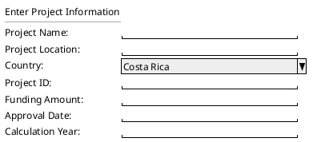

## Requerimiento Funcional: Pantalla de Ingreso de Información de Proyecto

**ID del Requerimiento:** RF-001

### 1. Introducción
El objetivo de este requerimiento funcional es detallar las especificaciones para diseñar e implementar una pantalla que permita a los usuarios ingresar y registrar información relacionada con proyectos.

### 2. Descripción
La pantalla brindará al usuario la posibilidad de introducir los siguientes datos de un proyecto:

- **Project Name**
- **Project Location**
- **Country**
- **Project ID**
- **Funding Amount**
- **Approval Date**
- **Calculation Year**

### 3. Requisitos de la Interfaz de Usuario

1. **Encabezado:** La pantalla contará con un encabezado con el título "Enter Project Information".

2. **Campos de Entrada:**
   - **Project Name:** Campo de texto.
   - **Project Location:** Campo de texto.
   - **Country:** Lista desplegable con una selección de países. Por defecto, mostrará "Costa Rica" pero brindará la opción al usuario de seleccionar otros países de una lista preestablecida.
   - **Project ID:** Campo de texto.
   - **Funding Amount:** Campo numérico con formato de moneda.
   - **Approval Date:** Selector de fecha.
   - **Calculation Year:** Campo numérico que solamente permitirá 4 dígitos.

3. **Diseño y Estilo:**
   - La interfaz deberá presentar un diseño limpio y profesional.
   - Los campos de entrada serán fácilmente visibles con bordes definidos.
   - La lista desplegable y los campos de texto tendrán un color de fondo verde claro, alineándose con el ejemplo proporcionado.
   - Cada campo estará adecuadamente etiquetado con su respectivo nombre en inglés.

### 4. Requisitos Funcionales

1. Todos los campos serán obligatorios para guardar la información.
2. El sistema validará que todos los campos estén completos antes de permitir guardar la información.
3. El campo "Calculation Year" únicamente admitirá números y tendrá un límite de 4 dígitos.
4. El campo "Funding Amount" validará que se ingresen solamente números y símbolos de moneda adecuados.

### 5. Requisitos No Funcionales

1. La pantalla se adaptará a diferentes tamaños de pantalla (responsividad).
2. La información ingresada en los campos se almacenará de forma segura en una base de datos.
3. La pantalla será compatible con los principales navegadores web.

### 6. Diseño de Pantalla

