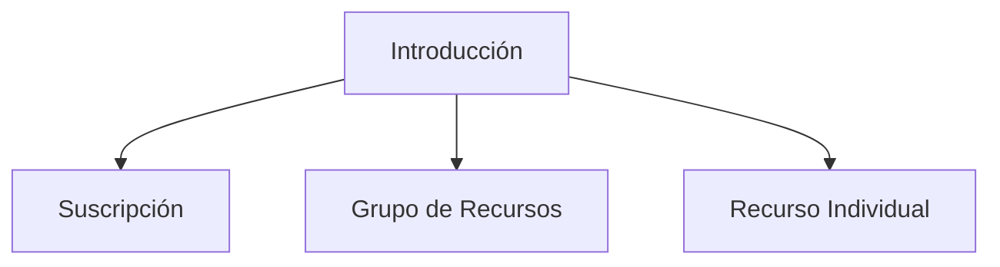
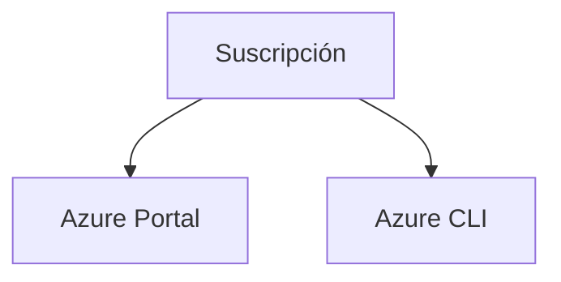
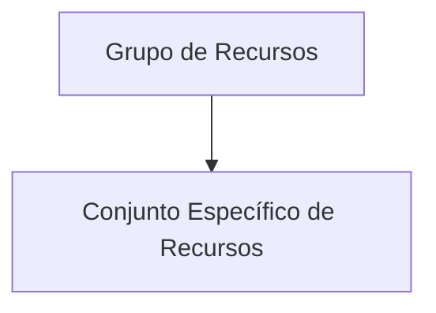
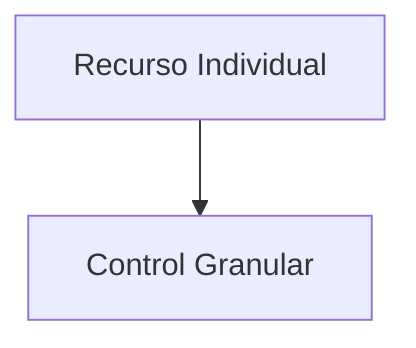

# Provisión de Acceso a Recursos de Azure mediante la Asignación de Roles en Diferentes Ámbitos

## Introducción

En Azure, la asignación de roles es un mecanismo crítico para gestionar el acceso a los recursos dentro de una suscripción o un grupo de recursos. Los roles pueden asignarse en diferentes niveles o ámbitos, como suscripciones, grupos de recursos y recursos individuales. Comprender cómo asignar roles en estos diferentes ámbitos es esencial para una gestión eficaz del acceso.



| Término         | Definición                                                                                             |
|----------------|-------------------------------------------------------------------------------------------------------|
| Suscripción    | Un contenedor lógico para los recursos de Azure.                                                       |
| Grupo de Recursos | Un contenedor que agrupa recursos relacionados para su gestión.                                        |
| Recurso Individual | Un objeto individual, como una VM o base de datos, que forma parte de una suscripción o grupo de recursos. |

## Suscripción

Para asignar roles en el nivel de la suscripción, uno generalmente utiliza el portal de Azure o la línea de comandos de Azure (Azure CLI). Al asignar un rol a este nivel, el acceso se concede a todos los recursos dentro de la suscripción.

### Ejemplo de Código para Asignar Rol en el Nivel de Suscripción

```azurecli
az role assignment create --assignee "correo@ejemplo.com" --role "Contributor" --scope "/subscriptions/{subscription-id}"
```



| Término      | Definición                                       |
|-------------|--------------------------------------------------|
| Azure Portal | Interfaz web para gestionar los recursos de Azure.|
| Azure CLI    | Línea de comandos para gestionar Azure.          |

## Grupo de Recursos

Los roles también pueden asignarse a un grupo de recursos específico. Esto es útil cuando se necesita dar acceso a un conjunto específico de recursos sin conceder permisos para toda la suscripción.

### Ejemplo de Código para Asignar Rol en el Nivel de Grupo de Recursos

```azurecli
az role assignment create --assignee "correo@ejemplo.com" --role "Reader" --scope "/subscriptions/{subscription-id}/resourceGroups/{resource-group-name}"
```



| Término                    | Definición                                                                          |
|----------------------------|-------------------------------------------------------------------------------------|
| Conjunto Específico de Recursos | Un grupo de recursos agrupados bajo un único Grupo de Recursos para su gestión.     |

## Recurso Individual

Para un control más granular, los roles pueden asignarse directamente a un recurso individual. Este nivel de asignación de roles es adecuado cuando se requiere un alto grado de control.

### Ejemplo de Código para Asignar Rol en el Nivel de Recurso Individual

```azurecli
az role assignment create --assignee "correo@ejemplo.com" --role "Reader" --scope "/subscriptions/{subscription-id}/resourceGroups/{resource-group-name}/providers/{resource-type}/{resource-name}"
```



| Término          | Definición                                                       |
|------------------|------------------------------------------------------------------|
| Control Granular | Asignación de roles a nivel de recurso para un control específico.|

## Cuadro Sinóptico

| Nivel de Ámbito      | Herramienta Principal | Nivel de Control   | Ejemplo de Rol Common  |
|----------------------|-----------------------|--------------------|------------------------|
| Suscripción          | Azure Portal, Azure CLI| Amplio             | Contributor            |
| Grupo de Recursos    | Azure CLI             | Medio              | Reader                 |
| Recurso Individual   | Azure CLI             | Granular           | Reader                 |

Al entender cómo asignar roles en diferentes niveles, se podrá gestionar de manera efectiva el acceso a los recursos de Azure.
